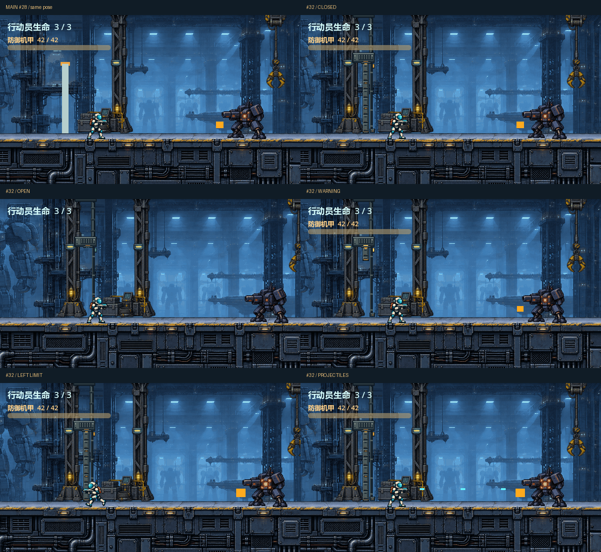

# #32 入口闸门 · 场景一体化返工稿（待用户审看）

基准：`3f970aafdd4628d0da931997197e630a7736735b`（#28 后 main），沿用 #22 已认可的救援机库。仅提供独立美术和真实关卡上的临时预览；未接入正式 CombatEntry。需求权威：[GitHub #32](https://github.com/immorcoding/hundouluo/issues/32)，后续工程接入为 #33。

## 设计

用户看过首轮后指出「大门做成那种和背景一体场景样式，不然太突兀了」。首轮完整保存在 [first-pass](first-pass/README.md)，对应提交 `9fc86e4`，不是已认可版本。新版把同源的 #22 立柱作为承力结构，卷收梁从柱身伸出，顶部管路连到天花，后侧导轨落到甲板锁座；闭合门板嵌在这个结构内。开放时仍有完整的机库建筑构件，不再悬浮一个小盒。原生同机位返工对照见 [first-pass-comparison.png](first-pass-comparison.png)。

| 状态 | 画面信息 | 美术姿态 |
| --- | --- | --- |
| 开放 | 同源立柱、接顶管路、卷收梁和后侧导轨构成环境；中间门板槽为空，暗青定位灯 | `open.svg/png` |
| 警告 / 下降 | 琥珀灯常亮、向下小箭头、带亮边的门靴逐步下降；不频闪 | `warning-0` 到 `warning-5` |
| 关闭 | 连续钢板落到甲板，两个黄铜横栓；没有透空的“可通行”中缝 | `closed.svg/png` |

每帧 96×252，最近邻 1:1 显示。锚点为 `(64,252)`，放在世界 `(3444,252)`；活动门板位于本地 x=[57,71)、y=[104,252)，仍对应现有 14×148 碰撞范围。左侧立柱、顶部连接与右侧细导轨/锁座是**后景装饰结构**，没有新增碰撞，统一绘制在行动员、机甲和弹丸后方。结构均停在甲板 y=252 上方，不铺盖甲板立面。复用柱保留 #22 原始柔边 alpha；新增门板和几何为整像素不透明色块，没有平滑缩放。

六个警告姿态露出深度为 8/16/28/44/62/80px，末帧仍保留 68px 下方通道，能容纳 52px 高身体。**真正碰撞闭合时才切换落地姿态**；最后 68px 是快速落锁，不能把这段图稿解释成提前关闭碰撞或延长警告。预览仅观察原有关卡计时和碰撞，视觉不控制它们。取消时直接回到卷收态；若用户不喜欢最后落锁的速度或取消读数，应在本票修改视觉稿，不能暗改 0.22s 窗口。

## 原生实景与短循环

以下截图由 Godot 4.7.2 OpenGL Compatibility 图形会话直接保存视口，**每张 640×360、未重绘合成**。关卡、机甲、行动员、弹丸和碰撞为真实实例。预览脚本只在临时实例隐藏旧入口图形、把新图形放在行动员/弹丸后面；初始站位由脚本设置，随后射击与退避使用 Input 动作。不是真人试玩录像。

| 核对 | 文件 |
| --- | --- |
| #28 原竖条，同机位同姿态 | [baseline-closed.png](baseline-closed.png) |
| 开 / 警告 / 关 | [scene-open.png](scene-open.png) · [scene-warning.png](scene-warning.png) · [scene-closed.png](scene-closed.png) |
| 贴近封锁边界 | [boundary-closed.png](boundary-closed.png) · [boundary-combat.png](boundary-combat.png) |
| 实际弹道 | [scene-combat.png](scene-combat.png) |
| 警告期左退取消 | [retreat-warning.png](retreat-warning.png) · [retreat-cancelled.png](retreat-cancelled.png) |
| 六图同尺度对照，每格保留 640×360 | [review-sheet.png](review-sheet.png) |

三段各 2.2s 的原速循环：[正常闭合 GIF](scene-loop.gif)、[边界 GIF](boundary-loop.gif)、[左退取消 GIF](retreat-loop.gif)。每段循环的尾部跳回开放，是重新播放拍摄序列，**不表示同一次战斗内自动开门**。GIF 为共享 256 色调色板，20/10/20ms 三帧共 50ms；全色 APNG 使用 17/16/17ms 三帧共 50ms，以毫秒精度表达 60Hz 采样，分别为 [scene-loop.png](scene-loop.png)、[boundary-loop.png](boundary-loop.png)、[retreat-loop.png](retreat-loop.png)。支持 APNG 的浏览器可直接播放；编码器会合并连续相同画面并保留停留时长。



## 可编辑源、来源与许可

新增门板、梁、管线、导轨、锁座与灯采用代码逐像素绘制，**不是人工手绘**。为完全匹配已有机库，静态承力柱直接复用仓库 `assets/pixel/hangar_mid.png` 的 `(28,0)-(90,252)` 区域，不缩放；它来自 #22 已认可的项目原创生成辅助层，没有外部游戏素材。`build.py` 是主制作源，保存调色板、几何及柱裁切坐标。八张 SVG 内嵌柱 PNG 并保留独立分组的新增几何，可独立打开编辑；PNG 是同源透明导出。继续可重复构建时修改 `build.py`；直接编辑 SVG 后须同步导出，重跑脚本会覆盖 SVG。

返工期间尝试过一次内置 ImageGen，请求以本项目 #22 中景和首轮实景为风格参考、生成透明的机库闸门结构。工具返回 `image generation failed: connection failed: error sending request`，没有生成文件或可用输出。本轮没有使用此次调用产物，也没有切换 CLI/API 或请求密钥；随后依用户要求继续用代码原生层和现有 #22 图层制作。

| 实际使用内容 | 来源 / 权利记录 |
| --- | --- |
| 新增门板/结构几何、制作代码、工具与本文 | 本项目原创代码制作，沿用根目录 [MIT LICENSE](../../LICENSE) |
| SVG 内嵌柱层及 PNG 中的柱层 | `assets/pixel/hangar_mid.png` 首个柱，同一仓库 #22 已确认原创生成辅助资产；继承下一行来源说明，不是本票新生成或手绘 |
| 实景中的机库、甲板、行动员、机甲 | 仓库 #22 已确认原创生成辅助资产；来源与限制见 [art_source/README](../../assets/art_source/README.md) 和 [PROMPTS](../../assets/art_source/PROMPTS.md)；本票没有重新授权或宣称独占版权 |
| 原竖条及现有关卡反馈 | 基准提交的项目代码，根目录 MIT LICENSE |
| Pillow / Godot | 制作与预览工具，不作为外部游戏素材；没有新依赖进入游戏运行时 |

所有交付文件已本地化，离线可重建。`art/entry_gate/.gdignore` 使审稿源与循环不被正式游戏导入。

## 重现

在指定工作树根目录运行（Python + Pillow 10.4.0，Godot 4.7.2）：

```powershell
python art/entry_gate/build.py
& Godot_v4.7.2-stable_win64_console.exe --headless --editor --path . --import
& Godot_v4.7.2-stable_win64_console.exe --path . --rendering-method gl_compatibility --fixed-fps 60 --script tools/preview_entry_gate.gd
python art/entry_gate/package_previews.py
```

逐帧原片保存在忽略提交的 `capture-frames/`，打包脚本不缩放画面。正式 F5 主场景仍显示 #28 原入口。预览读取原有关卡的私有计时字段，仅限本票观察工具；#33 应自行确定正式视觉接缝。

## 验证与人工确认边界

预览观察到：正常/边界序列警告从 frame 32 开始，frame 46 闭合，即 60Hz 下 14 帧约 0.233s；原代码仍为 0.22s，逐帧计时量化未改。左退取消序列通过真实向左输入跨回 x<3463，未发生闭合。边界序列关闭后向左走最终停在 x≈3463.075，机甲完整入镜。

目视核对：门关闭的连续边缘可见，材质不再是浅色平条；贴边行动员绘制在门前，枪管轮廓完整；门在机甲炮口左方，橙色危险提示与青色己方弹丸仍明显；没有把新图形伸入 y≥252 的低位甲板；警告态下方通道仍空，取消后不残留假门板。0.22s 本身较短，箭头和灯只能辅助读数，不能证明首次游玩的反应公平性。最后快速落锁、亮度与取消速度仍需用户观看原速循环确认。

自动验证记录见 [VALIDATION.md](VALIDATION.md)。返工期间保持 ready-for-agent；按用户最新明确的票内人工闸门规则，预览正式发布后转为 **ready-for-human** 并保持 OPEN，表示等待用户审看，**不表示审美批准**。当前稿不当作定稿，不合并，不接入正式游戏；后续反馈继续在本票返工。
