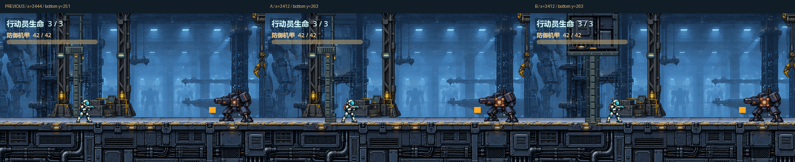
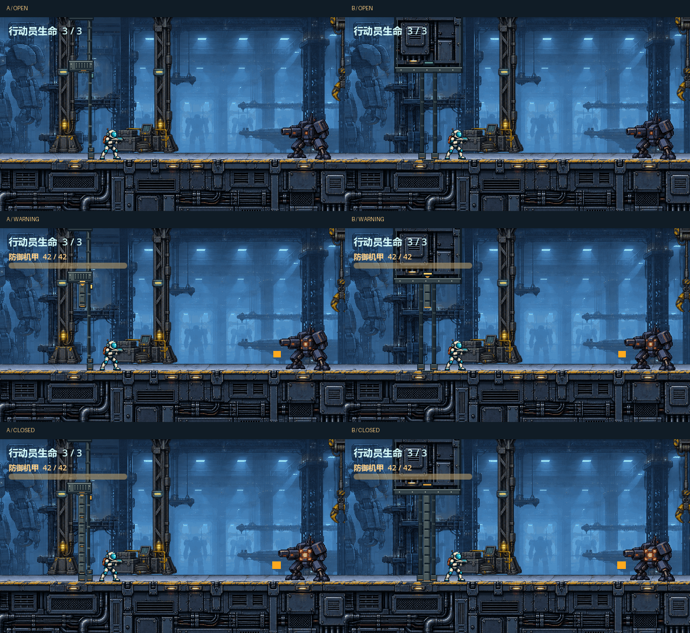

# #32 A/B 人审原型 · 左移、下探与墙中门方向

本轮依据用户 [标注图](https://github.com/immorcoding/hundouluo/issues/32#issuecomment-5884286951) 和 [墙体方向补充](https://github.com/immorcoding/hundouluo/issues/32#issuecomment-5884300636)。已下载并实际查看 [user-markup.png](user-markup.png)：箭头按左移方向理解，圆圈对应门板/锁座下端，不移动行动员脚部；标注不是精确坐标。上轮源与预览仍原位保留于父目录，首轮仍在 `../first-pass/`。

## 两案如何比较

| 方案 | 结构与取舍 |
| --- | --- |
| **A 改良立柱门** | 保留 #22 同源承力柱和上轮卷收梁；整组向左 32px，门靴/右锁座下探 12px，与甲板亮面接合。遮挡最少，延续已审看的材质。 |
| **B 甲板同源墙式门洞** | 使用 #22 甲板的金属面板、管线与铆接节奏作上墙体，中央窄门嵌在左右对称连续门框之间；两侧墙脚连接同源甲板基座。门洞顶部 y=104，留出原跳跃轮廓。 |

**B 的限制必须一起看：**现有关卡是侧视行进，实际屏障仅 14px 宽。B 是“上墙体 + 中央门 + 后景双侧门框/墙脚”的侧视结构试案，不是已经实现宽实体侧墙的完整正面墙门。两侧门框处于行动员后面的场景平面，不增加固体侧墙；中央门洞在开放时透明，行动员可从前方路径穿行。跑跳捕获证明未遮住行动员，也暴露这项景深约定，不能据此宣称真实墙体碰撞已经解决。若仍读作穿过实墙，B 应继续返工或舍弃；若用户要求两侧墙也成为实体，#33 必须另做空间/碰撞设计，不能把本稿直接接入。




原速并排循环，每段 2.5s，每侧原生 640×360，标题条在视口外：

- [开放→警告→关闭及弹道](entry-paired.gif)
- [警告中真实左输入取消](cancel-paired.gif)
- [关闭后左退至候选屏障](boundary-paired.gif)
- [开放时向左跑过](passage-walk-paired.gif)
- [开放时向左跳过](passage-jump-paired.gif)

独立 640×360 图和循环保存在 [A](A/) 与 [B](B/)。尾部回到开头是录像循环，不表示同次战斗自动开门。GIF 使用共享调色板，开关/取消/边界为256色，滚动跑跳为128色以满足附件大小；20/10/20ms 三帧共 50ms。原始全色 PNG 帧在忽略提交的 `capture-frames/`，可重拍重建。没有用生成场景替代 Godot 渲染。

## 候选坐标与 #33 接入要求

| 项目 | 正式 #28 / 上轮 | A 与 B 的同一候选 |
| --- | --- | --- |
| 整组 CombatEntry 中心 x | 3444 | **3412（-32）** |
| 屏障实际范围 | x=[3437,3451], y=[104,252] | **x=[3405,3419], y=[104,252]，仍 14×148** |
| 可见门板/门靴最后一行 | y=251 | **y=263（+12）** |
| 地面碰撞顶面 | y=252 | **252，不变** |
| 亮面附近前景脚底基准 | y≈263 | **263**，延伸部分纯装饰，绘在人物后方 |
| Commit / cancel 阈值 | x=3463 | **3463，不变** |
| 警告时间 | 0.22s | **0.22s，不变** |
| 闭合后相机中心下限 | 3580 | **3580，不变** |
| 闭合后行动员左侧止退中心 | ≈3463.075 | **≈3431.075** |
| 止退点至防御机甲中心 x=3830 | ≈366.925 | **≈398.925，仍小于 420px 射程** |

素材画布 128×288，锚点 `(64,252)` 对齐世界 `(3412,252)`。因此图片左上世界 `(3348,0)`，活动门板在本地 x=[57,71)、y=[104,252)，门靴延到本地 y=263；B 的甲板基座仅在 y≥264，位于脚底以下。

**这不是只平移图片：**`tools/preview_entry_gate_ab.gd` 仅在新建临时关卡实例中，将整个 `CombatEntry.position.x` 设为 3412，其中包含原有屏障；新图同位绘制。保存的正式 `.tscn`、`.gd`、碰撞资源、相机与输入文件均不变。原触发/取消阈值不跟随 -32px 平移，因为它们同时承担完整入镜的公平性约束；仍在双方完整可见、机甲预告后计时。新屏障后退 32px 所增加的战斗空间需由 #33 实施后再测。

#33 必须同步设置正式视觉与物理门位，复核以下行为：完整入镜且蓄力后才预告；0.22s 中退回 x<3463 取消；关闭后实际止退约3431.075且机甲完整入镜/仍在射程；不穿屏障/不被门靴卡住；开放状态跑跳门洞；死亡/通关/重试；镜头跟随与左限。若改变触发阈值或相机策略，必须重新设计并验证，不能盲目整体减32。

## 原始素材与来源

- `build.py` 是可编辑几何、源裁切与装配源；每案八张分组 SVG + 同源 PNG。SVG 内嵌栅格层，可离线打开，新增几何保持独立可编辑。不是人工手绘。
- A 调用父目录上轮的 `build.py`，保留原柱层及几何，新增门靴/锁座。柱来自 `assets/pixel/hangar_mid.png` 区域 `(28,0)-(90,252)`。
- B 墙体材质来自 `assets/pixel/hangar_deck.png`：上面板 `(240,24)-(368,104)`、下横条 `(480,24)-(608,36)`；底座用候选世界 x 对齐的区域 `(468,12)-(596,36)`，保持1:1，不拉伸。墙边、双侧门框、螺栓、门板和灯为本项目原创代码绘制。
- 以上 #22 项目原创生成辅助资产的来源/权利说明见 [原记录](../../../assets/art_source/README.md)。新增代码/几何按根 [MIT LICENSE](../../../LICENSE)。未新增外部游戏素材、字体、声音或生成图片。用户标注图只作为需求参考，不裁入运行图层，不额外主张授权。
- 本轮没有调用 ImageGen；上轮工具失败记录仍在父目录，失败调用没有产物。

## 重现与验证

在该工作树根目录：

```powershell
python art/entry_gate/ab/build.py
& Godot_v4.7.2-stable_win64_console.exe --path . --rendering-method gl_compatibility --fixed-fps 60 --script tools/preview_entry_gate_ab.gd
python art/entry_gate/ab/package.py
```

捕获为一个真实关卡瞬间先运行原逻辑，再暂停并交换 A/B 图层渲染；两侧相机、角色姿态、敌我弹丸和计时完全共享。暂停只为两案同帧比较，GIF 按60Hz模拟时间原速回放；不是实时人工操控录像。使用墙钟时间的机甲装饰帧采样可能受截图暂停影响，预告计时与碰撞仍使用原物理步长。额外跑跳序列在到达沿途机械兵前停止，不把沿途交战混入门洞核对。

正常/边界序列 warning frame=32、closed frame=46（原 0.22s 在60Hz下14帧量化）；取消序列未关闭，actor x=3460.5；闭合后止退 x=3431.074951。开放走过终点 x=3339.5；跳过终点 x≈3339.468，精灵矩形最上缘 y≈128.944，距门楣底 y=104 留约25px净距，未进入上部实心墙图层。

正式 Godot 全量32个独立检查均输出行为 PASS；7个既有退出清理错误仍在，名单见父目录 [VALIDATION.md](../VALIDATION.md)，严格日志口径不是全绿。相关入口/脚底/枪口检查无 ERROR。本轮五组图形捕获最终退出0，无 ERROR。

`f4669d0` 上 Python 全回归 **12/12 通过（17.215s）**，包含源码/Windows ZIP 和解压 EXE 启动。按上轮相同方法，在本工作树内忽略目录使用同提交临时克隆，TEMP 位于本工作树 `.godot/t`，没有越出授权树写包。16个SVG/PNG姿态重建哈希一致；15个GIF均2500ms；A/B关闭静图全部差异界限为 `(88,0)-(216,268)`，战斗区其余部分完全相同。

### Standards

独立代理复审 `git diff 421b30d...f4669d0`：0项硬违规、0项需报告的 smell。素材重建、原生尺寸、时长、来源、临时屏障同步位移与正式文件隔离均成立。

### Spec

独立代理复审：**1项已披露的部分满足**，B尚未形成完整实体墙门；下部仍是细框，上部才有宽墙面。已明确景深/碰撞限制，符合用户要求不能完整实现时如实报告，不能称全部满足。未发现越界或错误实现。

两维分别为 Standards 0、Spec 1（B墙体完整度部分满足）。用户选案或继续返工前，不作审美批准。

待用户选 A/B 或继续返工：#32 在制作期间 ready-for-agent；正式发布预览后 ready-for-human / OPEN，不代表审美批准，不合并、不接入正式游戏。
