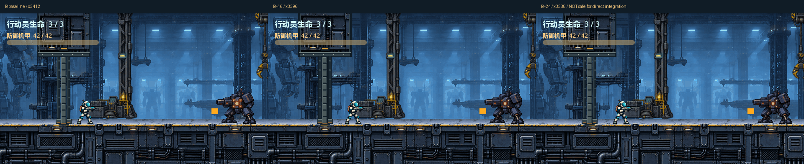
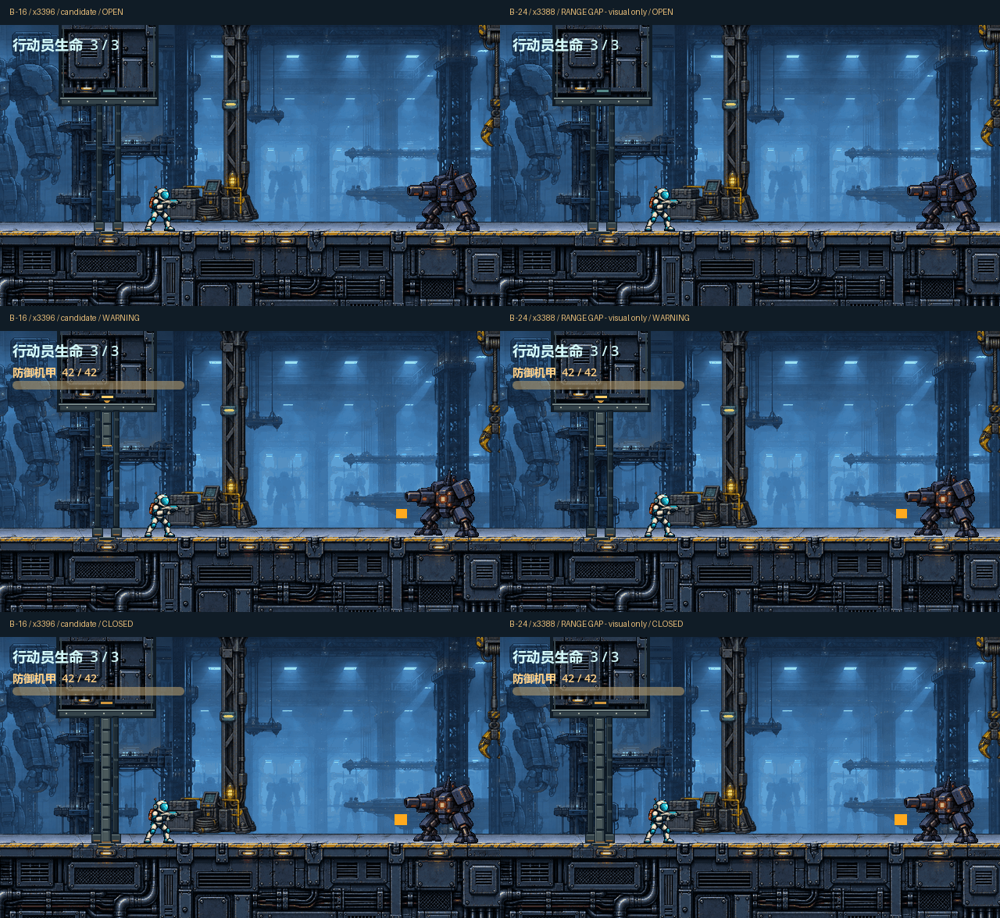

# B 再左移：16px / 24px 同机位小原型

依据 [#32 本轮反馈](https://github.com/immorcoding/hundouluo/issues/32#issuecomment-5884957759)，只在已倾向的 B 上做位置比较，不再修改 A 或历史素材。**建议优先审看 x3396（再左移16px）；x3388（再左移24px）已实测出现安全射击位置，只作更靠左的视觉对照，不可按原规则直接接入。** 两案仍待用户确认。

## 坐标及实测结果

| 项目 | B 基准 | B -16（候选） | B -24（仅视觉对照） |
| --- | --- | --- | --- |
| 整组中心 x | 3412 | **3396** | **3388** |
| 相对正式 #28 的 x3444 | -32 | -48 | -56 |
| 14×148 屏障 x 范围 | 3405..3419 | **3389..3403** | **3381..3395** |
| 闭合后实际行动员中心止退 x | 3431.075 | **3415.074707** | **3407.074707** |
| 与机甲中心 x3830 的距离 | 398.925 | **414.925293** | **422.925293** |
| 420px 射程余量 | 21.075 | **约5.075px** | **超出约2.925px** |
| 贴门等待：敌弹数 / 玩家生命 | — | **3 / 2**（初始3） | **0 / 3** |
| 正常输入探身一枪、立即左退，再等待 | — | 机甲42→41；玩家2→1；敌弹共6发 | **机甲42→41；玩家仍3；敌弹共0发** |

所有候选保留：门靴最后可见 y=263；地面碰撞 y=252；屏障 y104..252；Commit/取消阈值 x3463；警告0.22s；闭合后相机下限3580。未平移阈值或调整射程。仅临时实例整个 CombatEntry（含屏障）与图形同步平移；正式 scene/script/碰撞资源不变。

实际敌弹枪口为 `(3768,234)`，16px候选的行动员身体矩形为 `(3403.075,199.9253)`、大小24×52，敌弹 y234 落在有效受击高度内，并通过原碰撞事件真实扣血。24px候选不是“只差几像素也许还能被击中”：在完全入镜状态中，机甲因中心距离超出420而不发弹；一次真实向右输入+射击，再向左输入回到止退处，即可令机甲掉血而行动员不受伤。

因此 -24 会重现“从不可反击位置攻击”的问题。不得因外观更靠左就直接选它落地；若用户仍偏好，#33 需要明确工程设计、重新验证射程/门位/退避语义，不能私改数值迁就本稿。-16 通过了本次交战核对，但余量只有约5px，#33 仍须覆盖离散物理步长、左右面对、跳跃、重试与镜头边界。

## 原生视觉与运动




源码可生成五段并排循环（开关/交战、警告期取消、贴门、开放跑过、开放跳过）。每侧为640×360；非滚动序列按60Hz采样，跑跳循环从同源帧取30fps，每段都保持2.5s模拟时间。标题在游戏视口外，24px方案明确标为 RANGE GAP / visual only。尾部重播不是战斗中开门。

循环通过 #32 本轮评论附件交付，**不把 GIF 和750×2原始帧重复提交 Git**；`.gitignore` 保留本地产物，可按下方命令完全重建。Git 保留制作源、16张SVG/PNG姿态和精选原生静图。上轮所有源与预览保持原位。

捕获使用两个独立 World2D / 640×360 SubViewport，共享输入和物理时钟，同一渲染帧分别取图。正常入场/取消时角色状态同源；贴门时因不同屏障位置产生不同止退与攻击结果，是真实差异，未为了视觉一致伪造角色位置。敌我射击、健康值和碰撞均由原正式组件运行。截图时间型装饰帧不等于真人录像。

两案正常序列均警告frame32、关闭frame46；取消均不关闭、行动员x3460.5；开放跑过终点x3304.5、跳过约3304.468，精灵最上缘约y128.944，未进入y≤104的上墙体。

## 像素风指南检查与结构限制

已读取 [main 9d4c246 的 STYLE_GUIDE](https://github.com/immorcoding/hundouluo/blob/9d4c246/docs/art/STYLE_GUIDE.md)，[本地原文快照](STYLE_GUIDE-reference.md) 仅供溯源，仍以该提交原文为准。

- 640×360原生实景、最近邻、整数世界坐标；[3倍图](edge-3x.png)只用于辅助看硬边，未拿放大图代替实景。
- 本轮不缩放B、不重新生成、不做模糊/抗锯齿处理，保留有组织的门板/铆接像素与甲板同源纹理。上部金属面板来自现有 #22，脚座基板按各自世界x重新选取甲板区域，保持接缝与颗粒度。
- 原生图中行动员青白、机甲深色、青色弹道与琥珀预告仍可辨；左移让门框远离行动员通常站位。门靴仍贴y263亮面，没有移动玩家脚底或抬高碰撞地面。
- **仍有风格待收敛处：**上部复用甲板较密的管线/面板，而下部代码门框较平整、稀疏；本轮是位置选择，未解决整个场景的像素密度一致性，不能宣称全关卡风格已达标。
- **仍有墙体结构限制：**B下部为后景双侧门框，不等于宽实体墙；中央门洞透明且实际跑跳可通行，两侧景深约定仍需人审。本轮不称完整实体墙门已完成。

## 来源、编辑与重现

`build.py` 直接复用 [上轮B制作源](../ab/build.py) 的可编辑几何，仅设置候选x并重算世界对齐基板。每案8张SVG（内嵌原材质位图、几何独立）+ PNG，画布128×288、锚点(64,252)。柱梁/墙框/门板为原项目代码绘制，墙面/底座位图来自 `assets/pixel/hangar_deck.png`；没有新外部素材或 ImageGen 输出。来源/许可继承 [上轮记录](../ab/README.md) 与 [#22源记录](../../../assets/art_source/README.md)，新增代码按根 [MIT LICENSE](../../../LICENSE)。

在指定工作树根目录运行：

```powershell
python art/entry_gate/b-left/build.py
& Godot_v4.7.2-stable_win64_console.exe --path . --rendering-method gl_compatibility --fixed-fps 60 --script art/entry_gate/b-left/capture.gd
& Godot_v4.7.2-stable_win64_console.exe --headless --path . --fixed-fps 60 --script art/entry_gate/b-left/verify_boundary.gd
python art/entry_gate/b-left/package.py
```

## 验证边界

图形捕获五组序列通过，无ERROR。独立实战探针验证真实扣血和单帧输入探身射击：行为通过/退出0，但末尾有6个ObjectDB实例与3个资源的退出清理日志；未改正式对象生命周期消除它们。原入口、机甲循环、枪口相关检查再次通过。最终回归、双维审查和远端状态见 #32 本轮交付评论。

保持独立原型分支。发布后 ready-for-human / OPEN，等待选定位置；不合并，不接入正式游戏，#33仍须等待设计确认。
