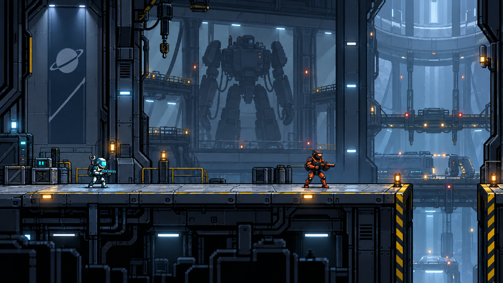
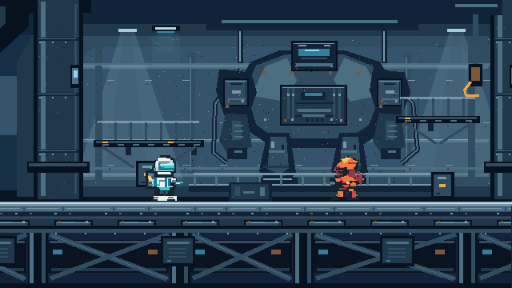
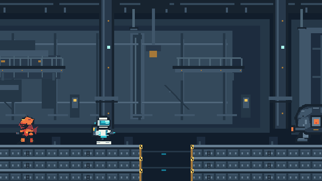
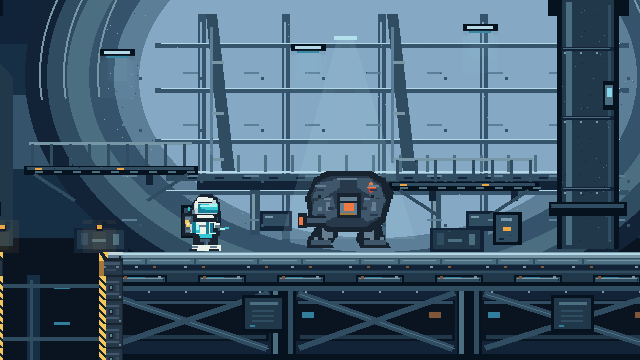
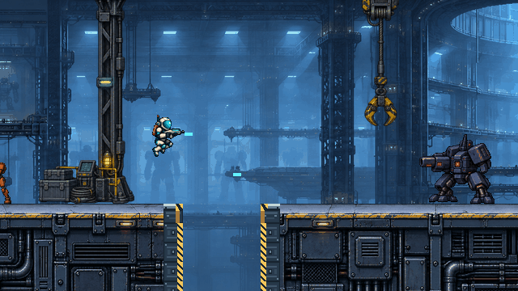

# #22 · 救援机库原创美术返工

> 本文是 #22 的历史制作及审查记录，不是覆盖所有资产的当前规范。跨关卡、角色、特效与 UI 的目标和检查项见[总体美术风格指南](STYLE_GUIDE.md)。下文“当前状态”保留当次交付语境；#22 后续已由用户认可并并入 v0.1.0。

当前状态：**供用户审看，未验收**。首次 `398b5f4` 被[退回](https://github.com/immorcoding/hundouluo/issues/22#issuecomment-5873999918)，程序绘制的第二版 `b1a747a` 也不是认可版本。本轮按[最新优先顺序](https://github.com/immorcoding/hundouluo/issues/22#issuecomment-5874757519)继续原创视觉验证，未使用 #23 开放素材、未推进 #24。

这轮使用 **ImageGen 分别生成独立素材，再做分层与图集后处理**。不称为手绘，不把一张含角色／平台的合成概念图当成游戏场景。原始位图、完整提示词、裁切坐标、程序源都保存在仓库中；C 草图只作对照。

## C 构图与真实 Godot 视口

下列实机图均由 `tools/capture_hangar.gd` 调用 Godot 视口截图，不是外部绘图软件拼出的游戏画面。逻辑视口 640×360，窗口 1280×720、整数缩放。

| C · 救援机库参考 | 当前 Godot 640×360 实机 |
| --- | --- |
|  |  |
| 巨型远景机甲、深层机库和清楚的前景战斗层是构图目标。 |  |
| 冷暖照明与厚重工业甲板是材质目标。 |  |
| 概念图不能证明输入、碰撞和运动中可读性。 |  |

[C 的项目来源](https://github.com/immorcoding/hundouluo/blob/codex/visual-art-prototype/prototypes/visual-art/images/c-rescue-bay.png)。本地副本仅用于离线文档对照，`docs/art/.gdignore` 将它及截图排除在 Godot 资源导入之外。

实机自审：第一轮落地发现远景机甲高对比会抢角色，已定向降低其对比并加入蓝色空气透视；旧方块角色被独立的新姿态图集替换；图集裁切中的零碎邻帧像素也已清理。近景甲板用复杂面板、管线和磨损边缘承接视觉密度，黄色缺口仍保持明确边界。与 C 相比，机甲在第一个镜头中更居中、更大，环境的蓝色雾化较强；角色是生成辅助后缩放与限色，关键帧之间仍有细部差异，动画只有原有的少量关键帧。以上差异交由用户判断，不等同于专业逐帧手绘质量或审美验收通过。

## 运行与编辑

用 Godot **4.7.2 标准版**打开根目录 `project.godot`，F5 运行；A/D 或左右键移动、Space 跳跃、J 连续射击。跌落后重新运行。机械兵和固定机甲是无碰撞的美术展示体，未接入敌人 AI；死亡重试、正式五段关卡与 HUD 不在本轮范围。

`scenes/level.tscn` 保留远景 `HangarFar`、透明结构中景 `HangarMid`、前景 `Ground`、角色展示与玩法槽位。前景依旧由碰撞矩形定义左侧 [0,768) 和右侧 [864,1440)，缺口宽 96px、地面顶面 y=252。`scripts/level.gd` 按碰撞裁切甲板及黄色边缘。角色移动、输入、碰撞、镜头、射速和弹丸运动参数保留原值。复审发现新枪管比旧出生点高约 6px，因此在 `operative.tscn` 配置逐帧枪口坐标，由行动员按当前姿态和朝向取用；新增检查同时验证枪口像素和实际发弹信号。

| 运行图集 | 单帧 | 帧序 |
| --- | --- | --- |
| `operative.png` | 72×60 | idle, run_a, run_b, jump, fire, hurt, down |
| `mechanical_soldier.png` | 64×60 | idle, walk_a, walk_b, windup, fire, hurt, down |
| `defense_mech.png` | 136×90 | idle, charge_a, charge_b, fire, hurt, down |
| `base_tiles.png` | 24×24 | 原有 13 帧，见 `atlas.json` |

每帧宽度包含透明留白，不是碰撞宽度。行动员站姿不透明高度 58px，即画面高度 16.1%；脚底对齐原场景基线。角色使用 0/255 透明度、最多 48 个 RGBA 条目、最近邻显示；图块保留原 24 色约束。射击／受击／倒地及敌人蓄力关键帧保存于图集；运行脚本实际选择的状态与本轮之前相同，不将未接入的展示体动画描述成完整敌人行为。

## 制作来源与重建

[源文件与制作记录](../../assets/art_source/README.md)列明工具输出、处理方法和权利边界；[完整生成提示词](../../assets/art_source/PROMPTS.md)及 `frames.json` 一同保存。全部素材是项目本轮生成／程序制作，没有下载或混用开源包、字体、音效。

```powershell
python tools/build_pixel_art.py
& '<Godot 4.7.2 console.exe>' --headless --editor --path . --import
& '<Godot 4.7.2 console.exe>' --path . --rendering-method gl_compatibility --script tools/capture_hangar.gd
```

重建只需 Pillow 10+，不需模型调用或生成缓存。`tools/assemble_hangar_art.py` 做技术装配；`tools/legacy_pixel_art.py` 和 `tools/build_hangar_composition.py` 保留早先程序绘制的制作源。直接运行旧脚本会写到 `docs/art/legacy/`，不会覆盖现行游戏资产。旧 `scene-native.png` / `scene-3x.png` 及 `concepts/` 是 #19 历史预览，不是当前实机图。

## 检查与待确认

本轮原有 11 项 Godot 行为／场景检查及新增的逐帧枪口检查（共 12 项）、5 项 Python 资源检查、首次导入与主场景 90 帧启动检查均通过，`git diff --check` 通过。资源检查继续覆盖尺寸、透明度、调色板、帧引用与分层，角色调色板契约从 24 色调整为 48 色以容纳新的材质层次。尺寸／调色板测试不证明美术质量。

仍需用户在运动中判断：角色与环境是否达到 C 的视觉层级、缩放后的材质是否舒适、跑跳姿态和枪口位置是否协调、跨缺口时视野和危险边界是否清楚。自动检查不替代真人试玩。用户确认前保持 #22 开放，不合并 main。

## Standards

以 `b1a747a` 为固定点的独立代码复审：0 项未解决发现。未发现仓库明确编码规范文件，按 code-review 技能的代码异味基线检查，分层装配、裁切配置、构建入口和逐帧枪口配置职责清楚，没有值得提出的规范或可维护性问题。旧制作源的保留用于追溯。

## Spec

独立规格复审先发现 1 项枪口偏移问题，已修正并复查；最终 0 项未解决实现问题。分层资产、角色关键帧、来源、实机截图、画布和运行说明齐备，后备素材未接入。枪口修正保持射速、移动、碰撞和弹丸运动参数。用户审美验收仍待完成。

复审结果：Standards 0；Spec 0（1 项枪口问题已修复），不代表用户美术认可。
