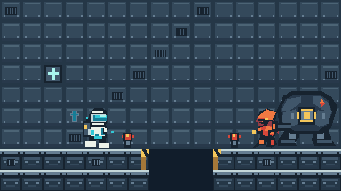

# Issue #19 — 原创像素资产交付

本节原为 #19 的像素资产交付记录；#22 将其扩展为下方的可运行救援机库美术验收片段，不代表完整关卡或战斗反馈实现。

## 正式可导入文件

`assets/pixel/` 下的四张透明 RGBA 图集是角色和图块资产，另有 #22 的远景、中景和甲板三张分层 PNG；`atlas.json` 是图集帧名、列序和锚点的机器可读清单。图集单行排列、无边距、无帧间隔，透明处 alpha=0，像素边缘未做抗锯齿。角色和图块的源文件是 `tools/build_pixel_art.py`，场景层的源文件是 `tools/build_hangar_composition.py`；运行 `python tools/build_pixel_art.py` 可重建全部，需 Pillow 10+。不要把 `concepts/` 的高分辨率概念图直接当作精灵导入游戏。

| 图集 | 单帧 | 列数／帧序（从 0 起） | 正面方向 |
| --- | --- | --- | --- |
| `operative.png` | 48×60 | idle, run_a, run_b, jump, fire, hurt, down | 右 |
| `mechanical_soldier.png` | 48×60 | idle, walk_a, walk_b, windup, fire, hurt, down | 左 |
| `defense_mech.png` | 104×90 | idle, charge_a, charge_b, fire, hurt, down | 左 |
| `base_tiles.png` | 24×24 | floor, floor_vent, gap_left, gap_right, wall, wall_vent, repair, rescue_sign, beacon_off, beacon_on, floor_sub, gap_wall_left, gap_wall_right | 不适用 |

行动员站姿、跑步两帧、跳跃、开火、受击与倒地；机械兵站姿、巡逻两帧、预告、开火、受击与倒地；防御机甲站姿、两段蓄力、开火、受击与损毁。机械兵胸前与机甲肩部共享橙红安防尖角标记，但各自体型仍能独立识别。机甲保持固定，蓄力核心增亮同时出现四边框，静音时也具有形态变化。`fire` 是射击瞬间姿态／枪口闪光，不包含弹丸贴图；受击帧不是无敌持续效果，反馈集成属后续票据。`down` 为终态，停留在原地；它不构成死亡／通关逻辑。

基地底板采用低饱和蓝灰。十字形救援标识、维修管线标记、可闪烁警戒灯、两种相反方向的黄色缺口边缘都自制。`gap_left` 放在缺口左侧最后一块实地，`gap_right` 放在右侧第一块实地；缺口本身保持空白，不使用伪装成地板的贴图。`repair` 和 `rescue_sign` 是覆盖层；`beacon_*` 具有透明背景。地板和墙图块按需重复，最终关卡布局需由关卡票据决定，示意图并不是关卡方案。

## Godot 4 导入建议

Sprite2D 使用对应 PNG，启用 `hframes` 为列数、`vframes=1`，按照 JSON 的序号设置 `frame` 或定义 SpriteFrames 的 AtlasTexture 区域。纹理过滤设 `Nearest`，不使用压缩引起的边缘混色；整数倍放大。角色统一以单帧底边中心为站立锚点，建议用 Sprite2D 的 offset 将这一点对齐角色脚底；`down` 仍占更新后的 48×60 或 104×90 单元。敌人反向面对目标时可使用水平翻转，注意左右枪口、背包不对称细节也随之镜像。透明像素不是碰撞形状；碰撞体、可受击区域、机甲蓄力时长、动画时序和地图碰撞仍须在正式工程按试玩调试。

24px 图块在 #22 场景中只用于缺口警戒边缘；可走甲板使用独立的连续纹理并按碰撞段裁切。`scene-native.png` / `scene-3x.png` 是 #19 的 384×216 旧示意，并非现在的游戏镜头；四张 `*-frames-3x.png` 可审看更新后的帧。实际显示大小以如下 Godot 截图为准。受击、弹丸、静音可判读与关卡公平性不能仅据静态预览宣布验收通过。

## #22 · 救援机库实机场景与 C 草图对照

| C 救援机库方向草图（生成参考，非入包画面） | Godot 4.7.2 真实视口（原创资源） |
| --- | --- |
|  |  |
| [单独查看 C 草图](https://github.com/immorcoding/hundouluo/blob/codex/visual-art-prototype/prototypes/visual-art/images/c-rescue-bay.png)：黄边断崖、停放巨型机体与多层机库定义视觉层级，未取用图像像素。 |  |
| 草图的终点方向有宽阔的空间和更密的环境材质。 |  |
| 草图没有检验实际输入、碰撞或跳跃视野。 |  |

首次实机提交 `398b5f4` 被用户[明确退回](https://github.com/immorcoding/hundouluo/issues/22#issuecomment-5873999918)：重复墙板、均匀暗色、没有机库主体与巨型远景机甲，角色过粗。本次重画不是在旧墙面上堆小装饰：远景以停放救援机体为左侧焦点、环形舱门为右侧空间；中景非对称梁柱、吊具、维修栈桥和分段冷光；前景改为大跨距承重桁架的厚甲板，仅在真实缺口边缘使用黄色警戒。它仍比概念草图的写实材质更抽象、更硬边；保留这项差异供真人审美判定，不声称逐像素复刻或通过验收。行动员图集 60px 高，站姿不透明包围盒约 58px，即 360px 视口的 16.1%；实际窗口由 Godot 报告为 1280×720，逻辑视口 640×360，使用 viewport + integer 缩放；仓库保留的截图是其 640×360 逻辑视口原生采样。

`tools/build_pixel_art.py` 是三角色更新帧的可编辑制作源；`tools/build_hangar_composition.py` 逐形状绘制 `hangar_far.png`、`hangar_mid.png`、`hangar_deck.png`，不读取 C 草图。角色沿用 #19 自绘轮廓和关键帧，在 48×60 / 104×90 网格进一步补上罩面分层、背包与气管、尖角护甲、枪体、足部、机甲关节和核心细节。`scenes/level.tscn` 分离 Far、Mid、Ground、ArtSamples 和玩法槽位；碰撞矩形界定左侧 [0,768) 与右侧 [864,1440)，`scripts/level.gd` 据此裁出两段甲板资源、放置真正的空缺与两侧警戒边缘。画出来的甲板只在可碰撞的实地上。机械兵和防御机甲仍只是无碰撞画面展示体，不接入 #15 未合并的行为；可跑跳、左右连续射击、跨缺口，但跌落后暂须重新运行场景。

制作、许可：上述所有新增像素均由仓库内 Python/Pillow 形状指令本地绘制，和 #19 原素材同受根目录 `LICENSE` 约束；没有把 C 概念 PNG、第三方贴图、字体或音效用于游戏资源。C 草图只在本说明中链接供并排审看。可用 `python tools/build_pixel_art.py` 确定性重建图集、背景、甲板和帧预览，首次导入用 Godot 4.7.2 的 `--headless --editor --path . --import`。实际截图由 `tools/capture_hangar.gd` 在 Godot 图形会话中读取视口产生，不是 Python 拼贴；其中动作帧通过输入动作驱动角色运行、跳跃、射击，仍不能代替真人试玩。

仍待用户真人试玩：运动中轮廓与黄色缺口是否足够醒目、60px 主角与前方视野是否舒适、跨 96px 缺口的手感、静音时危险辨识、不同显示器整数缩放。#22 不因自动检查而宣告美术验收通过；#15 敌人 AI、#16 正式五段布局、HUD 和死亡重试均不在本票完成范围内。

## 制作来源与权利边界

- 可编辑的正式图集源是本仓库 `tools/build_pixel_art.py`；本文、`atlas.json`、四张小图集和预览均由该源制作。代码中色板、轮廓坐标和动画变体是本次为本项目绘制，并受仓库根 `LICENSE` 约束。
- `concepts/` 下四张大图是本次用内置 image generation 按下列原创描述产生的概念参考（2026-09-28）；不从图中自动采样颜色、缩小或切帧。生成图自身存在软边、非统一像素尺寸和复杂照明，故不用于游戏运行资源。最终像素图集按概念方向重新绘制。生成过程未输入第三方角色、商标或现成游戏截图。
- 本票没有下载或打包 Kenney、字体、音效或其他第三方素材，因此没有需要登记的第三方实际入包文件；将来使用它们时仍需按 [许可研究 #4](https://github.com/immorcoding/hundouluo/issues/4) 逐文件审查。不得把概念参考误标为第三方许可证明。
- 需求依据：[本票 #19](https://github.com/immorcoding/hundouluo/issues/19)、[父规格 #12](https://github.com/immorcoding/hundouluo/issues/12)、[原创视觉决策 #7](https://github.com/immorcoding/hundouluo/issues/7)、[许可研究 #4](https://github.com/immorcoding/hundouluo/issues/4)。只借鉴横向跑跳射击类型，不借用经典作品的造型、标志或关卡排列。

### 概念参考的生成提示（内置工具，非游戏最终图）

四张图分别要求透明背景、无文字／商标／水印、硬边有限色板的游戏概念：

1. `operative-concept.png`：轨道基地救援维修行动员；青白色、紧凑偏圆、亮面罩、单侧工具背包；朝右全身姿势。
2. `mechanical-soldier-concept.png`：失控安防机械兵；橙红色、尖角装甲、窄暗传感器、前向发射器；朝左全身姿势。
3. `defense-mech-concept.png`：固定宽体深蓝炭色防御机甲；橙色蓄力核心、低位炮口、两侧支撑；朝左全身姿势。
4. `base-concept.png`：蓝灰轨道基地维修通道，救援标识、警戒灯、缺口黄色边缘；侧视、无角色。

共同排除：经典游戏人物／关卡／Boss、已有标志、文字和水印。概念图仅供原创方向检查；正式图集全部在可编辑源中单独绘制。
