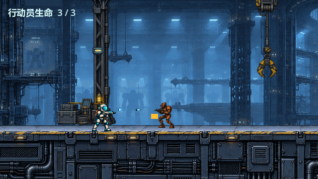
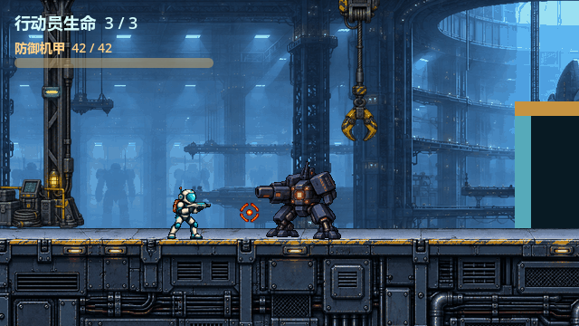
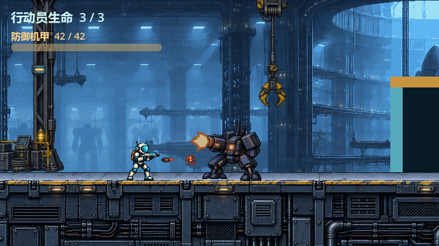

# #29 弹丸工程接入：原生画面与验收边界

从 #26 已批准分支 `codex/issue-26-projectile-art` 的 `afc81bd` 选择性导入 `assets/combat_v011/` 原图、图集、提示词和构建说明。关键上半环修订来自 `3004d42`。正式运行只引用 `atlas.png`；没有引入预览摆拍节点、背景重绘或第三方素材。素材随仓库 MIT 许可分发，制作方式与原始 ImageGen 记录见该目录 README/PROMPT。

下列图片由 `tools/capture_issue_29.gd` 在 Godot 4.7.2 图形会话中从实际 `scenes/level.tscn` 渲染，均为内部 640×360，不是后期拼贴：

与 #26 人审摆拍的差异：机械兵原游戏从局部 `(-26,-18)` 发弹，已批准摆拍将可见枪口校准至约 `(-27,-37)`；本票遵守旧低弹道，不上移碰撞体。机甲摆拍在高炮口显示环，并用 180 ms 视觉转场下落到原低弹道；这个转场不属于已批准玩法，本票让完整环与弹丸保持在原低位发射线。因而实际画面不是 #26 的高炮口构图，需要用户按保留旧玩法的版本审看。双方发弹处另有短命火光，命中敌人与墙分别使用 160 ms 图集短帧。没有强闪或震屏。

`scripts/level.gd`、`scenes/level.tscn`、HUD、终点闸门与相机均未改；#31 负责后续共用关卡接线。重新截图：`Godot_v4.7.2-stable_win64_console.exe --path . --rendering-method gl_compatibility --script tools/capture_issue_29.gd`。
