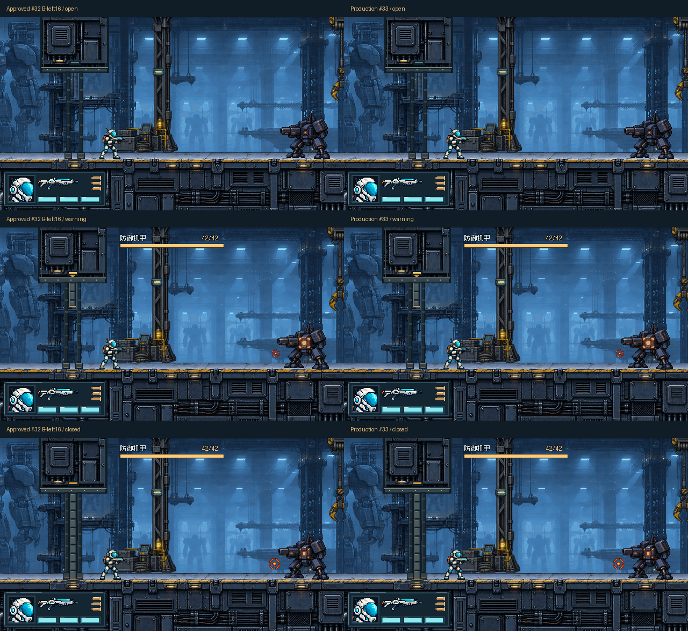
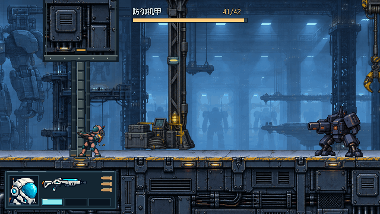
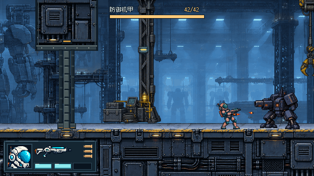

# #33 闸门工程接入验收

实施基线 `33dbcd1359b3a6d16f2941e31c483bccabd19ea7`，分支 `codex/issue-33-entry-gate-integration`。主目录与其未跟踪领域/代理文档只读沿用；所有实现、生成和测试在指定 E 盘 worktree 中完成。执行轮有效权限为 `danger-full-access / never`。#30 和 #32 在实施前均核对为 CLOSED，#33 保持 OPEN，等待协调会话复核合并。

## 改动边界

- 接入已批准 #32 B-left16（x3396），8 张128×288开放/下降/关闭素材无损打包，保留源 SVG、几何、调色板、甲板裁切与重建脚本；未使用新的生成图。
- CombatEntry 与原14×148屏障同步左移48px，范围 x3389..3403/y104..252；地面 y252，门靴可见末行 y263 是装饰。后景双侧门框不新增宽实体侧墙。
- 保持 Commit/取消 x3463、0.22s警告、机甲单一循环、420px射程、生命和伤害。仅在预告成立且实际闭门时固定 Camera2D 水平中心 x3580，警告退避取消时继续跟随。闭门后死亡/通关保留冻结画面；R重试重建关卡并恢复起点跟随。
- 固定视口世界范围 x3260..3900；完整门图 x3332..3460，完整机甲 x3766..3894，分别有72px左侧和6px右侧空间。普通交战时行动员也完整可见。未改 #30 HUD 子树或布局。

## TDD 与公开测试边界

采用已批准的真实关卡公开边界：`scenes/level.tscn`、实际 Camera2D 视口、可见 Sprite2D 帧、Barrier 是否禁用、普通输入、机甲/行动员生命及 projectile_fired/charge_started 信号。没有调用关卡私有方法或读取私有入口计时器。

1. 原入口测试先要求获批 Artwork 与 x3415.075止退，在基线上出现预期行为失败；接入图集/三态/门位后无诊断通过。
2. 新镜头测试先要求闭门后向右推进仍固定 x3580，在旧跟随逻辑上出现预期失败；实现闭门固定后通过。
3. 保留回归：六个下降帧、14个60Hz物理步警告、早/中/末期撤退取消，左右跑跳，闭门贴边交战/探身射击/左向跳跃，死亡和通关冻结与R恢复跟随。

最初新 worktree 导入日志目录未存在导致首次导入未执行，随后创建工作树内 `.godot` 并完成导入；该次类型解析错误不是TDD行为失败。镜头终态测试曾因上一发真实受击的无敌时间尚未到期而没有触发死亡，已通过等待原无敌窗口后再触发公开受击修正 fixture，未改变运行规则。

## 决定性公平性实测

`tests/level_entry_fairness.gd` 使用原场景/射程/伤害和正常单帧输入：

| 项目 | 实测 |
| --- | --- |
| 贴门行动员中心 | x3415.074707 |
| 机甲中心距离 / 射程余量 | 414.925293px / 5.074707px |
| 敌弹首发世界枪口 | (3768,234) |
| 贴门等待 | 3发敌弹，生命3→2 |
| 右1帧+射击、左1帧退回 | 机甲42→41；行动员2→1；总6发敌弹 |
| 左向贴门跳跃 | 无法越过屏障，机甲始终完整可见，落地后仍在止退内侧 |

因此固定镜头没有被用作射程修复，x3396实际可被反击；x3388仍排除。本位置余量很小，后续改门位/身体/射程时应重跑该测试。跳跃躲避低弹属于原有玩法，不能把合法躲弹等同于安全射击漏洞。

## 原生画面、获批对照与原速循环

每张单图为640×360。`capture-results.json` 保留状态、敌弹、生命、机甲生命与相机中心。生产图集与同场景直接放入获批源图的开放、warning-3、关闭、交战四个比对均逐像素相同。对照的每一格仍是原生视口：






| 循环 | 内容 / 原时长 |
| --- | --- |
| [入场](entry.gif) | 开放→警告→关闭→射击，2.5s |
| [撤退取消](cancel.gif) | 警告期间左退、恢复开放与跟随，2.5s |
| [贴门公平性](boundary.gif) | 贴边等待受击、探身射击再退回、再次受击，7.5s |
| [开放跑过](walk.gif) / [开放跳过](jump.gif) | 同步原门洞，无宽侧墙碰撞，各2.5s |
| [闭门推进](advance.gif) | 行动员右移、水平视角固定，2.5s |

这些是60Hz真实组件的脚本输入捕获，30fps取帧与GIF计时保留模拟原时长；不是真人录像。GIF预览减为256色，正式PNG/纹理保持原色。末尾回到开放是循环重播，不是战斗中自动开门。跑跳循环的后半段包含原沿途机械兵来弹和真实受击，不将它伪装为机甲攻击或清除来弹美化证据。

已目视核对原生开放/警告/关闭、贴门受击、向右推进和跳跃图：HUD仍位于左下，门靴对齐甲板亮面，行动员/枪管与机甲枪口/蓄力/弹丸在门框之前，开放跳跃轮廓未进入y104上墙体。3倍最近邻局部图仅辅助边缘检查。B上墙体较密、下框较平整的既有风格差异仍在；不声称整关像素风统一已经解决。

死亡/通关/跌落与三种R复位截图分别为 `death.png`、`complete.png`、`fall.png`、`retry-*.png`。

```powershell
python assets/entry_gate_v011/build.py
& Godot_v4.7.2-stable_win64_console.exe --headless --editor --path . --import
& Godot_v4.7.2-stable_win64_console.exe --path . --rendering-method gl_compatibility --fixed-fps 60 --script tools/capture_issue_33.gd
python tools/package_issue_33.py
```

原始帧在 `frames/`，可重建且不重复提交。保留精选PNG、GIF、制作/捕获脚本和状态JSON。全套测试与独立两轴审查结果见本目录 `test-results.json`、`code-review.md`。
