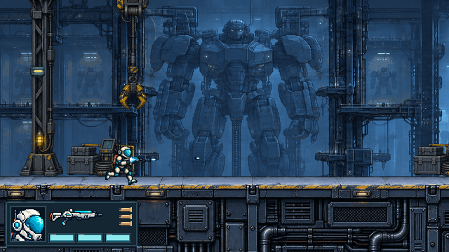
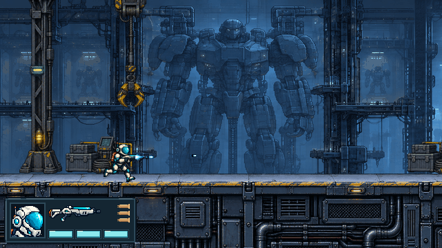

# #35 行动员跑射起点错位

用户反馈来自 [#31 人工试玩](https://github.com/immorcoding/hundouluo/issues/31#issuecomment-5911543601)，规格为 [#35](https://github.com/immorcoding/hundouluo/issues/35)。基线 `bb36822575c2adbdc464bcb8cf8d6dac7e8de266` 与用户试玩提交的运行代码一致。工作目录 `E:\Projects\game_hundouluo_codex_worktree\issue-35-running-muzzle`；主目录用户配置只读沿用，未初始化或提交配置，无相关 ADR。Godot 4.7.2，640×360，OpenGL Compatibility / NVIDIA RTX 4060 Laptop；本报告不宣称跨后端逐像素全等或代替用户复测。

## 结论与边界

错位的可见发射亮点是 **200ms 枪口短帧**。它由己方弹丸延迟创建为 Projectiles 下的世界坐标 Sprite2D，行动员每帧移动 3.5px 后，短帧仍留在旧发射点。真实跑射、变向和跳跃中最大偏差 72.5px。实际新生弹丸起点始终为图集枪口 0px 偏差，独立飞行也正常；只看 projectile_fired 中的起点会漏掉用户看到的运动问题。

修复：行动员拥有 Muzzle 锚点，物理姿态与受击姿态变化后立即更新，绘制前再次按当前姿态/朝向核对，枪口短帧挂在锚点上；行动员发出的弹丸关闭自身的世界坐标短帧。独立生成的己方弹丸仍默认创建原短帧，敌弹与通用 CombatFlash 的合同未变。死亡事件隐藏该锚点（也覆盖 level 的公开跌落死亡事件）。没有改角色/枪/弹丸素材、生命、移动/跳跃、射速、速度、射程、碰撞、伤害或敌方规则；没有修改 level、敌人、版本与打包文件。

## diagnosing-bugs：红色循环、最小化、假设

已批准测试边界：真实 level、普通 Input、公开 projectile_fired/receive_hit 事件与真实视口。BARRELS 是获批图集人工检查的枪管端点字面量，不读取生产 muzzle_offsets；既有 operative_muzzle 继续核对图集像素。普通出生场景不传送；follow 初始传送 (470,252)；fixed 初始传送 (3462,252)，再用普通输入触发真实关门，之后镜头必须保持 x=3580。完整 180 帧每次用普通按键连续跑射、变向、跳跃和落地；tick125 调用公开 receive_hit 展示受击姿态，不改健康或无敌时长。

快速最小命令（修前用基线临时副本，修后使用当前工作树）：

```powershell
Godot_v4.7.2-stable_win64_console.exe --path E:\Projects\game_hundouluo_codex_worktree\issue-35-running-muzzle\.scratch\issue-35\baseline --rendering-method gl_compatibility --fixed-fps 60 --script tools/capture_issue_35.gd -- --mode=minimal --ticks=2 --out=E:\Projects\game_hundouluo_codex_worktree\issue-35-running-muzzle\docs\bugs\issue-35\diagnosis\minimal
```

实际重复结果：约 2 秒；`ISSUE35 shots=1 ... failures=1`，`tick 1 flash detached 3.500 px`，exit1，无引擎诊断。去掉运动、射击或第2帧分别 exit0。完整场景的修前/修后数据：

| 场景 | 修前短帧最大错位 | 修前失败数 | 修后错位/失败 | 飞行检查样本 |
| --- | ---: | ---: | ---: | ---: |
| 出生固定镜头 | 72.5px | 190 | 0px / 0 | 1304 |
| 跟随镜头 | 72.5px | 179 | 0px / 0 | 1199 |
| 封门固定镜头 | 72.5px | 179 | 0px / 0 | 280 |

每个场景新生起点 0px，214 个实际可见短帧样本；飞行检查从发射事件与物理帧数独立计算原 520px/s 水平位移，允许累计浮点误差 0.05px。不同显示时序下，出生后已经过去的物理帧仍算作独立飞行，不把弹丸拉回角色。

先展示再逐变量验证的排序：

1. 世界坐标短帧不随枪：只重挂短帧到行动员，最小复现变绿。
2. 弹丸飞行/延迟创建：只冻结弹丸物理，仍偏3.5px；排除。
3. 跑步枪口标记：两种跑步帧端点同为 (31,-24)，首帧与发射事件0px，第2帧仍偏3.5px；排除。
4. 相机坐标：最小两帧镜头不动，仍失败；排除必要性。
5. 弹丸出生本身：三个真实场景始终0px，短帧独自脱离；排除。

初版循环只检查发射坐标而错误地变绿，随后补上实际短帧逐绘制检查；这一步揭示问题对象。首个辅助脚本有类型推断错误，已修正后才建立红信号。headless 的 process_frame 在节点 _process 之前发出，回归改为等该帧节点处理结束后观察，与实际 frame_post_draw 对齐。生产代码没有 DEBUG instrumentation；诊断探针仅留在命名明确的复现工具中。

## TDD 与验证

先写真实场景两帧回归，观察 `visible running muzzle detached: 3.500 px`；修复后变绿，再扩展同一 seam 的三个镜头、左右、连射、变向、跳跃/落地、受击和独立飞行。最终 regression 与图形循环共用真实场景操作，避免两个测试维护不同的模拟实现。基线副本运行扩展回归仍失败（590项），日志见 [baseline-regression.log](baseline-regression.log)。

[loop-results.json](loop-results.json) 保存完整命令、真实 exit、期望红/绿状态、诊断和耗时，27条严格通过：10条基线/最小化/探针，3条修后真实镜头，9组30/60/120Hz物理×30/60/120fps显示，以及5组真正图形绘制。原始红记录明确期望exit1；成功记录均exit0且无ERROR/SCRIPT ERROR/WARNING，未把退出0单独当成功。

复建原始基线：在本工作树 `.scratch/issue-35/baseline` 解压 `git archive bb36822575c2adbdc464bcb8cf8d6dac7e8de266`，复制当前 tools/capture_issue_35.gd 与 tests/operative_running_muzzle.gd 进去；显式以该副本为 --path 导入。随后：

```powershell
python tools/check_issue_35.py --godot (Get-Command Godot_v4.7.2-stable_win64_console.exe).Source --baseline E:\Projects\game_hundouluo_codex_worktree\issue-35-running-muzzle\.scratch\issue-35\baseline
python tools/present_issue_35.py
git archive HEAD -o .scratch/issue-35/verification-source.zip
Expand-Archive -LiteralPath .scratch/issue-35/verification-source.zip -DestinationPath .scratch/issue-35/verification-source
python .scratch/issue-35/verification-source/tools/check_issue_35_suite.py --godot (Get-Command Godot_v4.7.2-stable_win64_console.exe).Source --output E:\Projects\game_hundouluo_codex_worktree\issue-35-running-muzzle\docs\bugs\issue-35\verification-final --temp E:\Projects\game_hundouluo_codex_worktree\issue-35-running-muzzle\.scratch\issue-35\package-temp
```

独立双轴 code-review 已完成，初审和增量见 [code-review.md](code-review.md)；完整套件结果将在完成后补充。既有枪口图集、双阵营独立短帧清理、行动员连射方向三项已通过，无诊断。运行器保持既有打包的干净提交守卫；原有测试工具仍会先运行全部 Python（含 Windows 两项端到端）、导入、全部 SceneTree 行为、主场景无界面/图形90帧，再追加本票继承式 SceneTree 回归。

## 原生画面与独立像素证据




无损原速 APNG：出生跑射/变向/跳跃/落地 [修前2秒](before-spawn-loop.png) / [修后2秒](after-spawn-loop.png)；跟随镜头 [修前1秒](before-follow-loop.png) / [修后1秒](after-follow-loop.png)；封门固定镜头 [修前1.5秒](before-fixed-loop.png) / [修后1.5秒](after-fixed-loop.png)。全部640×360，保留区间内每一原生帧，fcTL按1/60秒精确编码，解码后逐像素对原始帧验证，未改任何运行美术。区间详见 [presentation-results.json](presentation-results.json)；完整180帧的所有 pose/位置数据仍在 before/after-* 的 trace.json，原始逐帧PNG保留在 E盘对应 frames/，Git只省略可复建原始帧。

独立像素 probe 以批准战斗图集的 >94% 不透明短帧亮点匹配实际视口，不读取生产枪口偏移或重画背景，容许25RGB的真实背景混合差异和1.5px对角栅格误差。修前350个高置信样本明确错位；修后483/486样本明确对齐、0明确错位，3帧因透明混合仅17/23亮点符合而保留“置信不足”，其最优匹配位置仍仅0.5px。没有把置信不足改成通过；短帧最后一帧是低透明余迹，没有可匹配不透明亮点，使用实际节点对齐与逐帧图补充。该 probe 是画面证据，不替代完整行为回归或人工复测。

独立 Spec 审查发现并证实了一项新增修复的终局时序风险：120Hz物理/30fps显示，同帧变向后真实赢弹碰撞会在 _process 前冻结行动员，保留旧枪口朝向。tests/operative_muzzle_victory.gd 使用初始传送与公开机甲受击降低fixture时间，实际射击、变向、赢弹碰撞均用正常路径；94b6f28副本红（[victory-before.log](victory-before.log)），b72673c绿（[victory-after.log](victory-after.log)）。修复只在物理姿态和受击变化后立即同步锚点；同一私有局部枪口函数供锚点与弹丸使用，解决Standards的P3重复计算建议。两名代理增量复审均无未解决可行动项。完整套件另保留不加固定fps的既有音频fixture生命周期；独立审查加速60fps运行旧结局fixture暴露音频退出诊断，在原始基线同样发生，非本票引入，未改其测试来掩盖问题。

首轮完整回归 [verification/results.json](verification/results.json)：43个Godot行为与导入/启动全部exit0无诊断，Python18项中17通过，唯Windows包测试因TEMP在被测试projectRoot之内被既有目录守卫拒绝。最终验证用当前Git提交原样解压到本工作树 .scratch/issue-35/verification-source，TEMP用其兄弟目录，既遵守包守卫又把所有临时文件留在指定E盘工作树。未修改或绕过共享打包工具；该副本由原提交的git archive产生，包仍对应同一提交。首次失败明确保留。

PNG联系表仅用于导航，见 [contact-sheet.png](contact-sheet.png)，原生单图与APNG才是视觉尺度基准。编辑器缓存、基线副本和包测试临时文件均留在本 E盘工作树的忽略目录；未触碰旧 #33。
