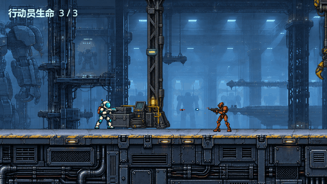
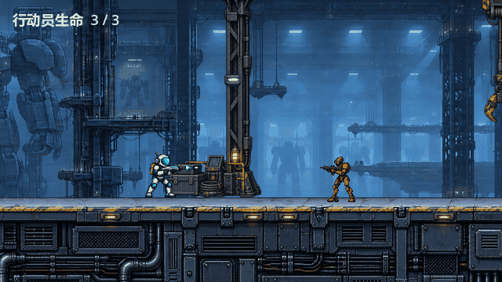
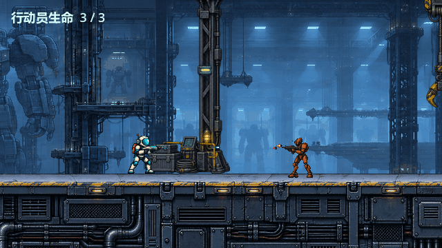
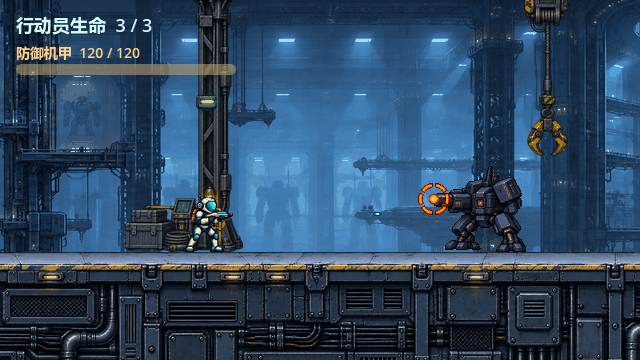
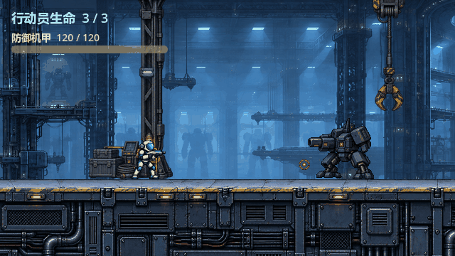

# #26 · 原生战斗视觉预览

以下图片均来自当前完整关卡的真实 Godot 4.7.2 / OpenGL 视口，640×360 原生像素。`capture.gd` 实例化现有 `scenes/level.tscn`，冻结行为，在独立预览节点绘制候选图集；角色、场景和 HUD 均由现有场景渲染。不是生成的关卡概念图，也不是已完成工程接入的实战录像。

普通交火（青白短弹与橙红尖弹）：





机械兵发射瞬间（发射后 33 ms）：



机甲蓄力（稳定分段扩张，没有明暗交替）：



机甲三发低弹道（沿用 220 ms 发射间隔）：




## 重现

从仓库根目录执行；需要图形会话、Godot 4.7.2 和 Python/Pillow：

```powershell
Godot_v4.7.2-stable_win64_console.exe --headless --editor --path . --import
Godot_v4.7.2-stable_win64_console.exe --headless --path . --script assets/combat_v011/build.gd
Godot_v4.7.2-stable_win64_console.exe --path . --rendering-method gl_compatibility --audio-driver Dummy --script previews/combat_v011/capture.gd
python previews/combat_v011/encode.py
python previews/combat_v011/verify.py
```

每段保存 48 个 PNG 视口帧（本地忽略的 `frames/`），12 fps、4 秒。GIF 以 80/80/90 ms 分配保持总时长；编码存在 GIF 调色板量化，PNG 为颜色审阅依据。

## 预览限制与待审阅

- 这是冻结关卡的动效摆拍。射击、命中点与墙面碎屑是定时展示，未运行伤害判定；不证明玩家能实际躲过所有展示弹道。
- 行动员约 58 像素高。请按 1× 审看三类弹丸是否读得清，机甲环是否过亮，橙红普通弹是否太细。
- 墙面命中采用场景箱体边缘作为材质示意；箱体不是新增地形碰撞体。
- 枪口及碎片的精确挂点、160 ms 命中映射和蓄力中断需后续工程票接入再验。此次不变更任何正式运行脚本、场景、HUD 或现有角色图集。
- 返工后按角色静止帧的可见枪口定位：机械兵局部 `(-27,-37)`，机甲 `(-51,-53)`。正式机械兵弹丸仍用 `(-26,-18)`、机甲充能仍用 `(-57,-18)`、机甲弹丸仍用 `(-62,-18)`；这些旧逻辑坐标与当前可见炮口不同，本设计票不改正式逻辑。
- 机甲摆拍弹丸从可见炮口起飞，前 180 ms 下移到既有低弹道高度。这只是衔接高炮口与低弹道的美术提案，不能作为已实现或已批准的运动/碰撞契约。后续工程票需要确认如何协调原低弹道与角色炮口。
- 静音预览可审查颜色之外的轮廓、环形蓄力和低位三连弹，但视觉舒适度及高速玩法识别仍待真人确认。

来源、逐帧契约、许可证与完整提示词见 [素材说明](../../assets/combat_v011/README.md)。

## 人审返工对照

[返工前预览（固定提交 46d09b4）](https://github.com/immorcoding/hundouluo/tree/46d09b48e760ba18f69c7d0acf5c2ff9a03dd653/previews/combat_v011)；本页为返工后。

机械兵问题来自预览套用旧逻辑高度；充能环问题来自源图非精确等分却按八等分裁切，第四帧顶部实体被截掉 29 像素。环原先已经位于角色之后绘制，不是 Z 遮挡；现另显式设 `z_index=100` 保证预览动效前置。环恢复 32×32 完整范围，源图未重画，其余七行动效不变。
