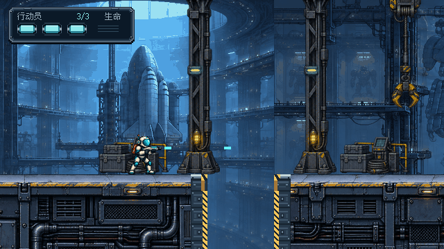
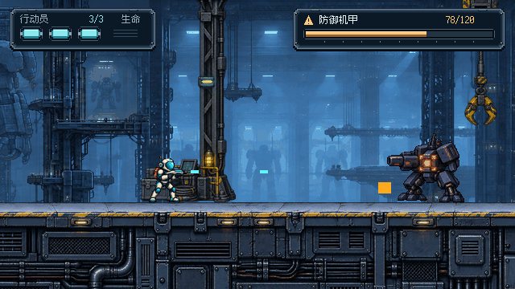
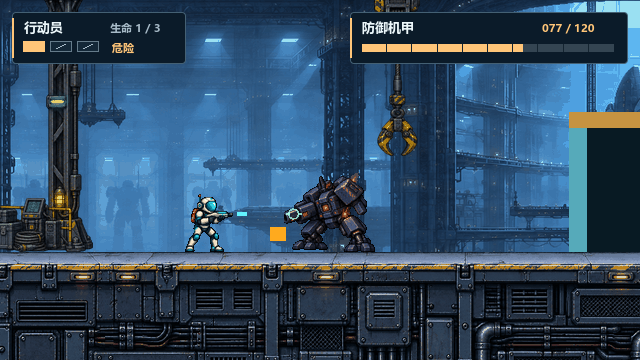
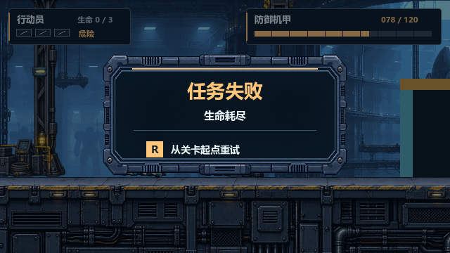
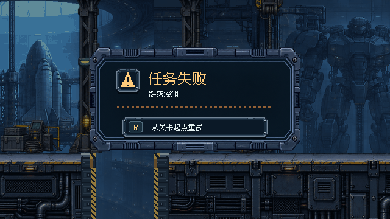
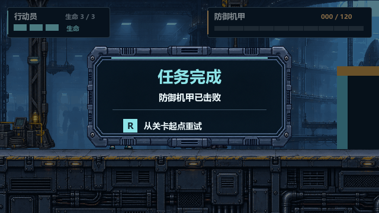

**本页为已退回的上一轮精修稿。当前待选方向见 [THROWAWAY A/B 粗排与查看器](throwaway-ab/README.md)，采用 #28 后 42 HP 主线截图。**

# #27 · 救援机库 UI 返工稿

**待用户审阅，未批准、未接入。** 分支 `codex/issue-27-ui-art`。按 [用户返工意见](https://github.com/immorcoding/hundouluo/issues/27#issuecomment-5883085443) 和 [Sol 调研](RESEARCH.md) 重做；唯一延续的认可元素是任务失败金属外框轮廓。上一稿完整版本保留在 Git 提交 `0a64617` 中。

本稿固定以游戏基线 `6b4505a`（#28 合并前）的真实 Godot 关卡为底，六种状态均可在 640×360 原生尺寸和 1280×720 精确整数 2× 下查看。以下是**真实场景 + 评审 UI 合成预览**，不是正式游戏接入截图。

**基线差异：主分支现已合入 #28，机甲为 42 HP，起点/终点视觉锚点亦有微调。本工作树未合并 #28；图中的 120 HP 与背景属于旧基线，是 UI 比例/边界示例，不代表当前主分支玩法数值。UI 使用实际 health/max_health 比例，无硬编码 120 的绘制规则，后续接入须用主分支数值再验证。终点捕获位置改为 x=3500，避开旧版右侧青色几何门挡，不修改或抹除场景。**

## 六态原生图与 2× 图

### 普通游玩 / 缺口

[查看 1280×720](previews-2x/start.png)

### 终点交火 / 机甲有损生命

[查看 1280×720](previews-2x/hud.png)

### 低生命 / 1/3

[查看 1280×720](previews-2x/low-health.png)

### 生命耗尽

[查看 1280×720](previews-2x/death.png)

### 跌落死亡

[查看 1280×720](previews-2x/fall.png)

### 任务完成 / 机甲 0/120

[查看 1280×720](previews-2x/complete.png)

额外边界小样：[生命 2/3](boundaries/life-two.png)（[2×](boundaries/life-two-2x.png)）、[机甲 120/120](boundaries/boss-full.png)（[2×](boundaries/boss-full-2x.png)）、[机甲 1/120](boundaries/boss-one.png)（[2×](boundaries/boss-one-2x.png)）。0/120 见任务完成图的明确数值；完成后不再保留顶部交战进度条。

## 本轮视觉变化

- 字体统一为入包的 **Fusion Pixel 12px 简体比例字**，常规字 12px、标题 24px；不再调用微软雅黑或系统回退。关闭抗锯齿、hinting、子像素和 MSDF，保持整数坐标。已核对所用汉字、R 和数字；完整原始字体、版权和许可见 [字体来源](source/fonts/README.md)。
- 两侧 HUD 改为阶梯切角、金属压边、少量铆钉与槽线；所有 HUD 细节按原生像素绘制，不缩小生成面板充当顶部模块。
- 三点生命改为三个独立装甲槽：青色实芯有亮边和固定夹，空槽是暗栅格；1/3 仅剩一格琥珀实芯，另有“危险”和读数冗余。没有心形、额外护盾值或新玩法。
- 机甲模块加入像素警示三角，血量槽有内外压边、亮芯与阴影。刻度移到槽下，不切断 1/120 的最后一像素进度。文字与连续条同源于当前实际血量。
- 失败框源 PNG、采样区域、位置及尺寸保持不变；框内字体、布局、警示徽记和重试铭牌重做。保留两种明确死因。
- 完成页采用像素勾形徽记、青色解除威胁标记、`防御机甲已击败` 和 `0/120`；与失败页的三角与琥珀警戒刻线不同，不只换标题颜色。
- 结算时隐藏顶部 HUD，背景遮暗由 48% 调到 40%；R 提示改成与 HUD 同语法的装甲铭牌。仍然只有 `R 从关卡起点重试`，未增加菜单或入口。

## 排版 / 状态交接

逻辑画布 640×360，所有矩形为 `[x,y,width,height]`。

| 元素 | 原生区域 / 规则 |
| --- | --- |
| 行动员底板 | `[12,10,182,52]`；投影末端 y=64（不含该行） |
| 生命格 | 首格 `[25,33,28,18]`，步距 36，共三格；3/3、2/3 青，1/3 琥珀 + 危险文字 |
| 机甲底板 | `[364,10,264,52]`；可见性读取既有 `HUD/MechProgress.visible` |
| 机甲槽 | `[377,36,238,13]`，实芯 `[380,39,232,7]`；232×health/max 向下取整，health>0 至少 1px |
| 结算外框 | `[146,76,348,174]`，源采样 `[20,92,1734,682]`，沿用被认可轮廓 |
| 状态徽记 | `[190,112,40,40]`，失败三角 / 完成勾形 |
| 标题 / 原因 | 左 x=244/245，基线 y=138/159；字号 24/12 |
| 重试铭牌 | `[200,192,240,34]`，字基线 y=214，12px；R 键帽独立 |

色板：信息青 `#8de9ed`、琥珀 `#ffcb7b`、主文 `#e5f2f2`、次文 `#9aafbd`、内槽 `#09141f`，低饱和蓝灰装甲。游玩时 y≥64 不绘制 UI；中部弹道与 y=252 地面/缺口保持原始像素。现有终点条件决定机甲 HUD 出现；预览不改变任何伤害、胜负、重试机制。结算 UI 是静态设计；正式游戏早已冻结角色/敌人，本工具不创造新状态。

## 制作源、许可与复现

- [design_ui.gd](design_ui.gd) 是原生 UI 图形与排版的可编辑源；[render_previews.gd](render_previews.gd) 只加载真实关卡、触发既有状态、保存截图，再叠加评审 UI。每张原始场景在 `captures/`，额外边界原图在 `boundaries/*-raw.png`。射击会使机甲捕获数值有一发左右的时序差异；原图和同帧 UI 一起捕获。
- [console-panel.png](source/console-panel.png) 为上一轮内置 ImageGen 原始 RGBA 面板，1774×887，本轮未改动。生成提示词与来源仍在 [PROMPT.md](source/PROMPT.md)。本轮只编辑 Godot 原生 UI，没有重新生成位图素材。美术是生成辅助与程序绘制，不称为手绘。
- 面板边缘保持原有整区采样缩放。若工程要做 NinePatch，建议在该源区域内保留左右150/上下100源像素，接入时重新验证；本轮没有把这些建议说成已实现。
- [字体原文件和许可](source/fonts/) 来自作者 `2026.09.25` 官方发布包，未裁字、改名或转换。随附 Fusion、Ark Pixel、Cubic 11、Galmuri 的上游通知。字体按其 OFL 条款分发，不受游戏根 LICENSE 替代。版本、官方下载地址、SHA256 均已记录；精确复现不依赖系统字体。
- 现有场景美术仍来自本项目 #22，来源见 `assets/art_source/README.md`；没有加入第三方美术包。本目录由 `.gdignore` 隔离，不进入正式资源导入或运行场景。

在指定 worktree 根目录执行（Godot 4.7.2，图形会话）：

```powershell
& Godot_v4.7.2-stable_win64_console.exe --headless --editor --path . --import
& Godot_v4.7.2-stable_win64_console.exe --path . --rendering-method gl_compatibility --script prototypes/issue-27-ui/render_previews.gd
python prototypes/issue-27-ui/verify_delivery.py
```

交付检查需 Pillow 与 fontTools；它只读文件，不修改图像。2× 图由 Godot 对本工具自身的原生渲染结果做最近邻整数导出，逐像素核对，无浏览器缩放或重新采样平滑。正式 F5 游戏仍为原 UI。

## 待人工判断

请先以 100% 原生尺寸看生命实槽/空槽、中文和机甲余量，再看 2× 图的边角与字形。重点判断新字体是否贴合 #22、装甲 HUD 是否协调、失败与完成能否瞬间区分、R 提示是否明确。静音移动/交火中的真人可读性尚未验收；截图与自动检查不能替代。**用户确认前不关闭、不合并、不接入。** 完整检查和双轴审查见 [VALIDATION.md](VALIDATION.md)。
