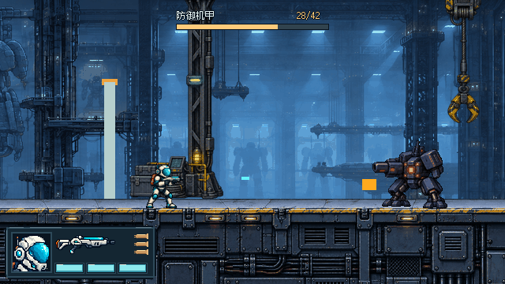
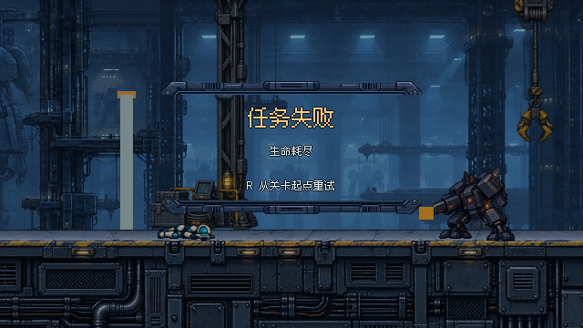
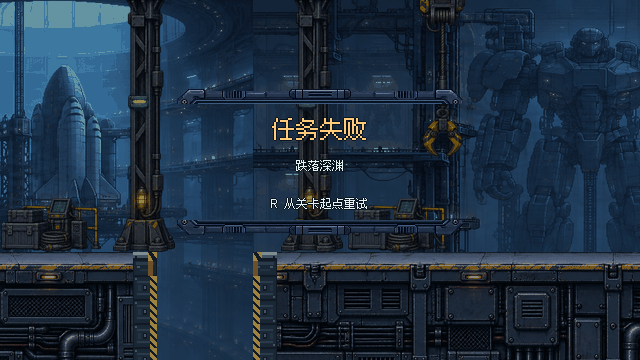
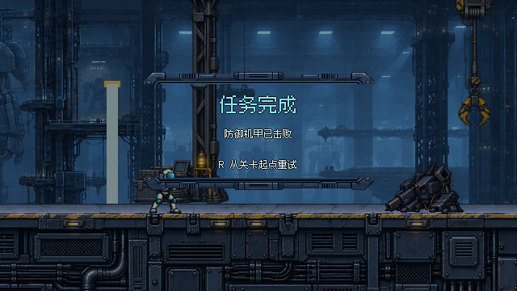

# #27 整票设计审阅：战斗HUD冻结，结算待最终确认

依据 [用户部分批准](https://github.com/immorcoding/hundouluo/issues/27#issuecomment-5885875724) 和 [main 2d98617总体指南](https://github.com/immorcoding/hundouluo/blob/2d98617/docs/art/STYLE_GUIDE.md)。本轮只收敛生命耗尽、跌落死亡、任务完成与R重试提示；**不再改已确认S6**。

## 批准边界 / 冻结记录

S6冻结为提交 `2092f7076e55b398a439ed21e4943e9371abf08a`：192×68、左下6px、1137dda旧详细头像、匹配枪形、18×7弹壳。其8张截图、两张源图、绘制脚本的校验值见 [approved-hud.json](approved-hud.json)；本轮已与该提交核对，PNG字节一致，GDScript仅统一LF后比较一致。



该批准不包含整票最终验收。半/全自动仍是视觉概念，实际玩法切换没有在本票实现。#30必须等待整票确认，本目录不接入游戏。

## 本轮三种结算 · 640×360

### 生命耗尽

[整数2×](images/after-failure-2x.png) · [与前轮文字布局同帧对照](images/compare-failure.png)

### 跌落深渊

[整数2×](images/after-fall-2x.png) · [与前轮文字布局同帧对照](images/compare-fall.png)

### 任务完成

[整数2×](images/after-complete-2x.png) · [与前轮文字布局同帧对照](images/compare-complete.png)

这是**真实冻结场景＋设计UI**合成，不是已接入运行时HUD。前后对照左边是前轮A的文字布局在同一状态底图上的重绘（跌落是新取样），右边是本轮收敛稿。

## 排版与视觉收敛

- 结果标题 → 死因/完成说明 → R从起点重试，三行统一以x=320居中。只保留这三项信息，不加结算分数、按钮组、徽记框、步骤轨、库存或菜单。
- 失败琥珀标题、完成青色标题；原因白色，明确分别为“生命耗尽”“跌落深渊”“防御机甲已击败”。R三态完全一致，表达重载整关而非检查点。
- 复用曾获肯定的细节金属外框**上/下边沿**，保留机械接缝、压边和少量固定点，侧面开放。没有把整张厚框或多层按钮框套回来，也不修改战斗HUD。
- 标题24px、原因与R为12px，沿现有Fusion Pixel简体字体；整数坐标、nearest、关闭抗锯齿与系统回退。字体许可沿现有source/fonts，不新增字体。
- 全屏36%深蓝均匀遮暗（前轮30%）；无渐变、模糊、闪烁或动画。角色倒地/机甲倒地及缺口仍可识别，HUD槽在结算预览中隐藏。已有正式玩法冻结机制不在本票改动。

| 元素 | 最终逻辑像素 |
| --- | --- |
| 顶部金属边沿 | `[176,88,288,16]` |
| 底部金属边沿 | `[176,220,288,16]` |
| 标题 | 中心x320，基线y138，24px |
| 原因/说明 | 中心x320，基线y170，12px |
| R提示 | 中心x320，基线y208，12px |

标题优先、重试足够留白；金属只提供少量与S6/机库一致的细节，不承担主信息。此处的风格判断仍需用户确认，不以“同材质”替代人审。

## 原始资源 / 来源 / 接入交接

- 原框：`../source/console-panel.png`（内置ImageGen原创源，原提示词/记录在`../source/PROMPT.md`），原PNG本轮未改。
- 上沿源区域 `[20,92,1734,100]`，下沿 `[20,674,1734,100]`，均绘至288×16；nearest，颜色乘数(0.8,0.85,0.9,1)。这两个裁切定义即交接的布局资源，不依赖用户机器生成缓存。
- 全部文字和布局可编辑于 [render.gd](render.gd)，不是烘进生成源PNG。只复用项目已有艺术/字体，无外部新素材或新生成位图。
- `captures/failure.png`、`complete.png` 原样复制 #28后 `3f970aa` 原型真实死亡/击败捕获，机甲42HP；`fall.png` 在相同固定提交源码副本中，通过角色跌过死亡阈值触发既有逻辑，核验实际HUD死因为“跌落深渊”后隐藏旧HUD再捕获。`capture_fall.gd`为复现源，不修改游戏脚本。
- 最新指南2d98617用于风格；场景基线保持已批准HUD的3f970aa以便同帧审看，未引入 #32 改动。这里不谎称已在当前整合分支接入。

正式接入应复用原 `show_death(reason)` / `show_complete()` 与 `retry` 行为，另按 #30 执行；本渲染器只是评审工具，没有运行时连接或R处理，不应直接挂入正式场景。

## 一键整票审阅

双击 [Open-Review.cmd](Open-Review.cmd) 或本地打开 [viewer.html](viewer.html)。可查看冻结S6的普通/机甲/低血/缺口及本轮三种结算；已确认与待确认明确区分。结算可切前后、原生/整数2×；1/2/3直达生命耗尽/跌落/完成。GitHub只显示图片，不能运行HTML。

查看器R不执行游戏重试。内置浏览器的file://限制仍在，浏览器按钮/键盘交互未实测，不宣称浏览器验收通过。

## 复现与验证

```powershell
& Godot_v4.7.2-stable_win64_console.exe --path . --rendering-method gl_compatibility --script prototypes/issue-27-ui/outcome-review/render.gd
```

跌落取样：将 `capture_fall.gd` 复制到已归档的3f970aa场景副本根目录，在副本运行该脚本，并用 `-- <绝对路径/fall.png>` 指定输出。副本可由前轮 `throwaway-ab/rebuild.py` 固定提交步骤准备；不要改正式项目文件来拍图。

Godot最终渲染无错误/警告；跌落真实死因断言通过；三态640×360与1280×720逐像素nearest二倍核对通过。S6冻结资源核对通过；本轮git改动仅新outcome-review目录，未动正式HUD/level/弹丸或已批准素材。静态目视确认中文、死因与R没有压边，倒地/缺口语境仍可看见。

## 请求一次确认整票

- [x] 战斗S6方向已获用户确认且本轮未改。
- [ ] 用户确认生命耗尽与跌落能一眼区分、R“从关卡起点”语义清楚。
- [ ] 用户确认完成页层级与金属边沿份量，和已确认S6的调性一致。
- [ ] 用户确认三种结算在原生640×360下的字级/对比和场景遮挡。

勾选必须来自用户，不由代理代签。#27保持OPEN、ready-for-human；不合并、不接入，未宣称整票或全项目美术已验收。
