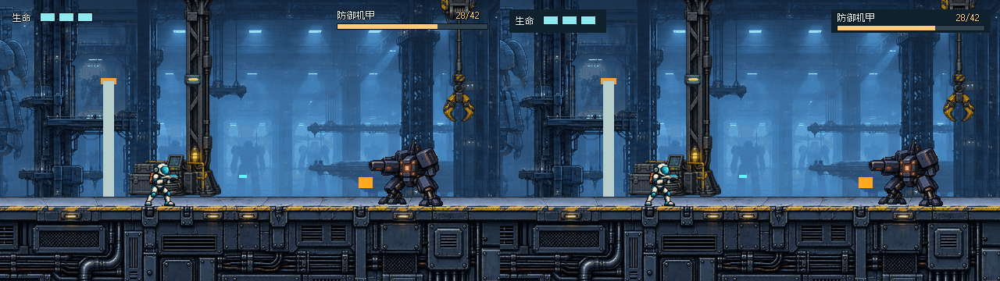
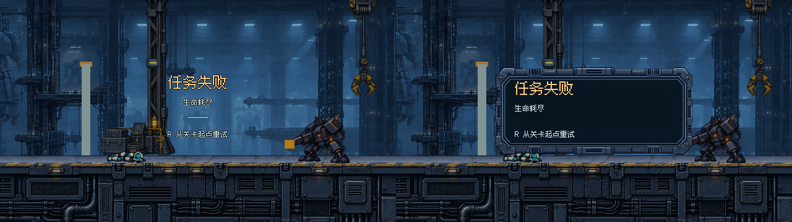
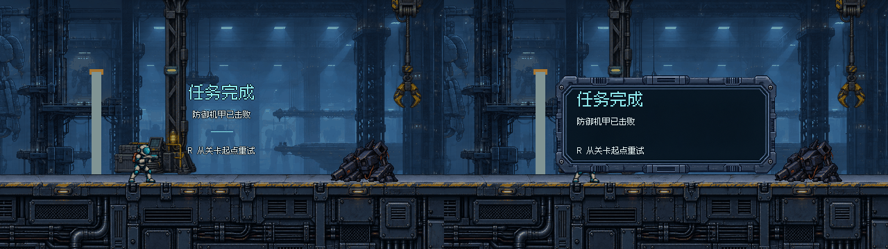

# THROWAWAY · #27 A/B UI 粗排

**临时原型，用户尚未选方向，不是最终设计。** 本轮仅回答：少量战斗信息和结算结果，用 A 的轻量叠字还是 B 的薄底条 / 单层容器更合理？字体仅作为相同实验条件，不视作人审通过。

依据 [经典 UI 研究](../RESEARCH_CLASSIC_UI.md)，不延续“所有组件同金属框”的做法。沿用研究建议的两种不同结构，暂不精修六态，也不改正式 HUD、level、伤害或主分支。

## 一键查看

双击 [Open-Prototype.cmd](Open-Prototype.cmd)，或直接用浏览器打开 [viewer.html](viewer.html)。无需安装依赖或启动服务器。

- `←` / `→` 或底部按钮：A/B 切换；地址 `?variant=A` / `?variant=B` 保留所选方案。
- `1` / `2` / `3`：战斗 / 失败 / 完成，或点击状态按钮。
- “并排 A/B”：同页对照；“原生 640×360”：切到精确 CSS 整数 2×。
- 页面始终标出临时原型、当前变体/状态/读数。此处只展示静态捕获；R 文案不执行游戏重试。

这是独立查看器，不是正式游戏菜单；`.gdignore` 隔离整个目录。GitHub 可以看 PNG，但不会运行 HTML；查看器需下载/在本地工作树中打开。

## 同场景并排：左 A / 右 B

每半张都是未经缩放的 640×360，组合图 1280×360；点击图可看完整像素。

### 战斗

[A 原生图](images/A-combat.png) · [B 原生图](images/B-combat.png)

### 失败

[A 原生图](images/A-failure.png) · [B 原生图](images/B-failure.png)

### 完成

[A 原生图](images/A-complete.png) · [B 原生图](images/B-complete.png)

## 两案分歧

| | A：轻量信息 / 文字结算 | B：薄仪表 / 单层面板 |
| --- | --- | --- |
| 战斗 | “生命”+三格直接叠场景；右上名称、准确读数与细进度；仅局部描边保护文字 | 同样信息，分别由 124×30、204×30 薄深色底条承托；不加铆钉、机箱或刻度 |
| 结算 | 标题、原因、R 全部居中；文字组周围连续场景；仅一条 32px 短线 | 320×144 单层金属面板；三行同一左轴；没有徽记框、按钮框、键帽、完成轨 |
| 优先级 | 场景先于容器，结果文字是重点 | 结果在明确的局部阅读区内，容器承托内容 |
| 需确认的风险 | 亮背景是否干扰小字；是否太轻 | 容器是否仍抢主体；是否值得占这块场景面积 |

共同条件：Fusion Pixel 12/24px，白/青/琥珀色；相同原始截图、文案与 30% 结算遮暗。战斗保留精确机甲读数，两案都去掉“行动员 / 3/3”等重复说明。两组 HUD 间开放空间超过 280px，绘制限于 y<44；生命格 18×10，机甲填充高6px。文字/进度是原生 Godot 可编辑绘制，面板仅 B 结算使用。

## 来源与准确基线

捕获基线是本轮开始时的 `origin/main`：**`3f970aafdd4628d0da931997197e630a7736735b`，已包含 #28，机甲上限 42 HP**。不是旧稿 120 HP 背景，也不是改数字冒充新场景。

`rebuild.py` 用 `git archive` 将该固定提交解包到本目录被忽略的 `.capture-project/`，只在该副本运行原版场景和捕获脚本。没有合并 main、改根目录关卡或写主仓库。场景中的浅色入场挡板是 #28 实际关卡元素，保留同一原始画面给 A/B 判断，不抹图。

`capture_main.gd` 通过现有受击/死亡/击败机甲逻辑捕获三态；终点位置 x=3510。`captures/states.json` 记录实际数值：战斗 3/3 与 28/42，失败0/3，完成机甲0/42。每种状态只捕获一次，再让 A/B 共用。`render_ab.gd` 分别排版并输出原生 PNG 和左右对照图。截图不是正式 UI 接入结果。

字体与既有面板来自 [本票原始素材](../source/)，字体许可/版权继续随附；未引入经典游戏图片、图形、标志或字体。本轮无新增生成位图素材。

## 修改 / 重建

已有 PNG 和查看器可离线直接使用。若改布局，只运行：

```powershell
& Godot_v4.7.2-stable_win64_console.exe --path . --rendering-method gl_compatibility --script prototypes/issue-27-ui/throwaway-ab/render_ab.gd
```

如需从固定主线重建背景，再渲染：

```powershell
python prototypes/issue-27-ui/throwaway-ab/rebuild.py
```

需要 Python、Git 和 PATH 中的 Godot4.7.2，图形会话；无需第三方 Python 包。`rebuild.py` 的副本仅用于复现，非第二个 Git worktree。不要编辑它作为正式开发目录。

## 本轮观察与尚待选择

原生六图已目视检查；Godot 最终渲染无错误/警告，尺寸为640×360，对照图1280×360；A/B 同态背景相同。按 prototype 流程不新增测试套件、不跑发布打包、不做无关玩法改动。内置浏览器的 file:// 安全策略拒绝打开本地查看器，因此**浏览器按钮/键盘交互未实测**；源码入口、图片路径与 URL 参数逻辑已检查，没有宣称浏览器验收通过。

**尚无胜出方案。请看图后选择：**

1. 战斗更偏好 A 的无底板，还是 B 的薄底条？机甲准确数值是否值得继续保留？
2. 结算更偏好 A 的居中文字与连续场景，还是 B 的单层面板与左对齐？可以混选。
3. 先读到的是结果、重试还是容器？需要增大中文，还是保留目前留白？

用户选定方向后才继续六态和边界精修；本轮不把选择器或粗排直接接入生产，不关闭/合并 #27。静态对比不证明运动中可读性。
