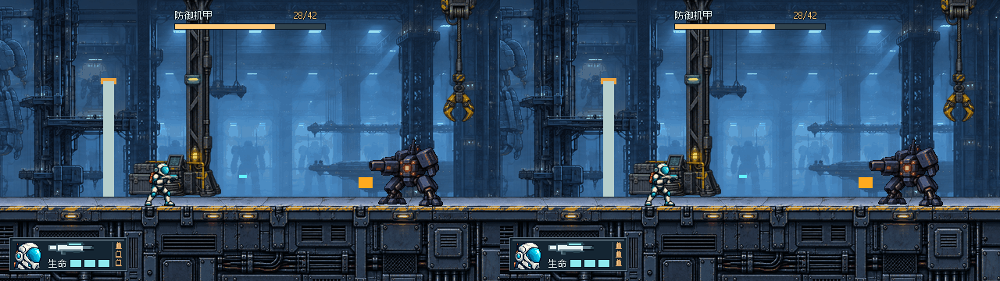
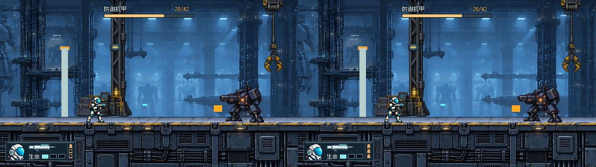
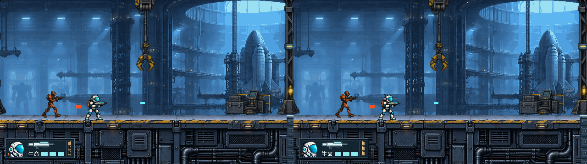
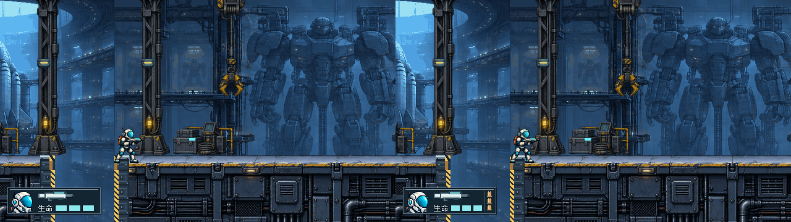

# THROWAWAY · E 射击模式视觉示意

**仅美术概念，半/全自动切换尚未实现。** 用户要求去掉“危险”，用竖向单列三枚弹壳表示模式：1枚实心＋2枚空轮廓=半自动概念，3枚实心=全自动概念。A/B/C/D保留作历史对照，E画面不再显示“危险”。

当前正式 `scripts/operative.gd` 只在按住shoot时按0.16秒间隔连发，没有半自动、模式开关或弹药库存。本轮不改变玩法、运行HUD、关卡或 #32，不创建实际玩法议题；玩法是否扩展等待用户另行决定。

## 一键可切换查看器

双击 [Open-Prototype.cmd](Open-Prototype.cmd) / 本地打开 [viewer.html](viewer.html)。默认E全自动**示意**。

- 半自动示意 / 全自动示意按钮只换图；URL支持 `?variant=E&mode=semi` / `mode=auto`。
- “同血量模式对照”显示左半自动、右全自动。两边角色生命、场景、机甲血量完全相同。
- “并排 D/E”保留新旧比较；旧C/D、A/C、A/B也可看。
- 左右键循环A–E；1–6切普通/低血/机甲/缺口/失败/完成；可原生640×360或整数2×浏览。
- 页面持续标明THROWAWAY、当前变体、概念模式与实际游戏无切换的说明；原型不会执行射击或R重试。

GitHub不能运行HTML，需本地目录打开。内置浏览器file://限制仍在，未绕过，因此浏览器按钮/键盘交互未实测；不宣称浏览器验收通过。

## 同血量：左半自动概念 / 右全自动概念

### 机甲战，双方生命3/3、机甲28/42


### 低血1/3，双方都保持同一血量

[1/3＋全自动原生图](images/E-auto-low.png)

### 普通交火


## 左D / 右E全自动概念：缺口遮挡不隐藏


[机甲D/E](images/compare-DE-combat.png) · [低血D/E](images/compare-DE-low.png)

结算沿D/C/A，**隐藏整个战斗模块**，所以半/全自动示意在失败/完成时无可见差异：[失败](images/compare-DE-failure.png) · [完成](images/compare-DE-complete.png)。

## 两种“三格”如何区分

| | 生命 | 射击模式概念 |
| --- | --- | --- |
| 方位 | 下方横排 | 最右侧竖向单列 |
| 形状 | 宽矩形槽，14×9 | 细颈口、筒身、凸底缘的弹壳，8×9外界，每枚间距2px |
| 颜色 | 青色实填、灰蓝空槽；低血仍青色 | 铜色弹壳；空壳保持铜色外轮廓 |
| 解释 | 仅一处“生命”标签，无重复3/3 | 查看器明确写半/全自动“示意”，不是弹药数 |

头像仍36×36，枪械仍58×16，Boss仍顶部居中。外框保持 `[12,304,152,44]` 不变；为了给独立模式列留空，生命从D的18×9略收窄到14×9，位置x=90/108/126、y=333。弹壳列x=148、y=310/321/332，x=144暗线分隔生命与模式。没有压小头像或枪，也没有新增框。

弹壳是本轮Astra原生Godot像素图形，见 `e_resources()`，没有新位图、下载素材或提示词。头像/枪械沿原来源，见 [头像记录](source/PORTRAIT.md) 及 `current_rifle()`；原有字体许可继续随附。

**需要人审的取舍：** 152×44内能同时容纳，但每枚弹壳仅9px高、生命格缩窄4px；模式识别是否清楚、空轮廓是否会读成弹药余量，不能由自动检查证明。低血只以一个实格与两个空格表达，按用户要求不再显示危险词。

## 遮挡和相同场景

使用既有 #28后固定提交 `3f970aa` 的六张真实场景，不重新取样；机甲上限42，示例28/42；普通/缺口未激活Boss。原数据见 [states.json](captures/states.json)。

E相对D的游玩像素变化仅在旧模块右侧，所有差异都在原152×44框内，头像、枪、框外场景和Boss条不变。**缺口下部及部分黄色竖边仍被同面积模块挡住；没有扩大，但没有解决。** 站立角色、正常弹道、地面顶边和门体在样本里未被覆盖。没有自动避让、抹图或 #32 改动。

## 运行 / 轻量验证

改排版后在worktree根执行：

```powershell
& Godot_v4.7.2-stable_win64_console.exe --path . --rendering-method gl_compatibility --script prototypes/issue-27-ui/throwaway-ab/render_ab.gd
```

最终渲染成功且无错误/警告；E两模式各六张640×360，组合图1280×360。A–D既有24图字节不变；同态半/全自动只在下两枚弹壳填充区域有差异；低血与满血不改变模式填充规则；结算像素相同。依prototype流程不加测试套件/发布打包，浏览器交互限制如前。

只需人审：弹壳能否认成模式而非弹药？一枚/三枚实填是否清楚？横排生命是否仍可数，尤其1/3＋全自动时？保持 #27 开放、ready-for-human，未合并、未接入；实际模式玩法另待用户决定。
