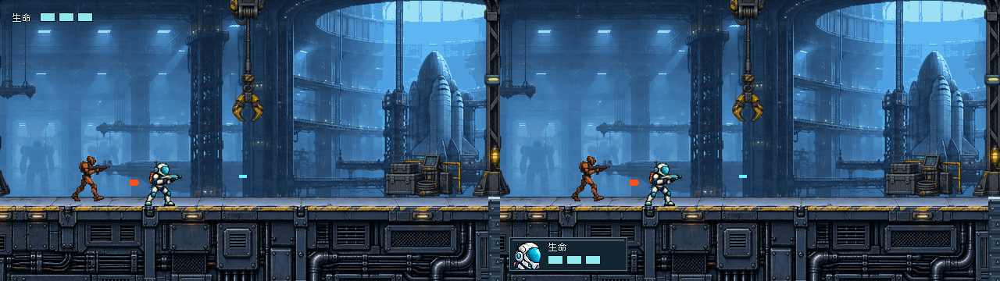
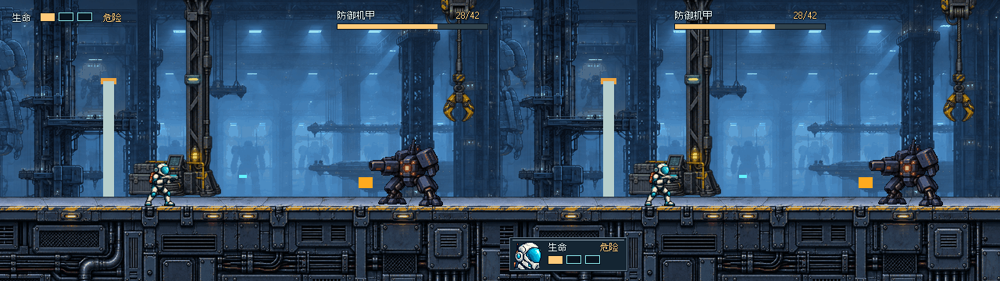
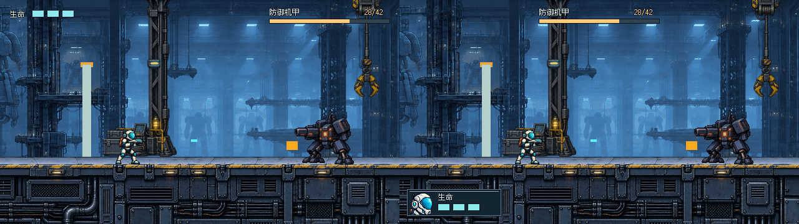
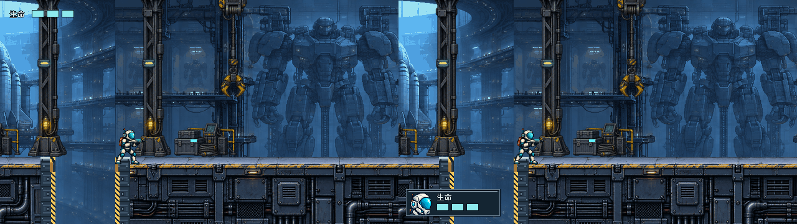
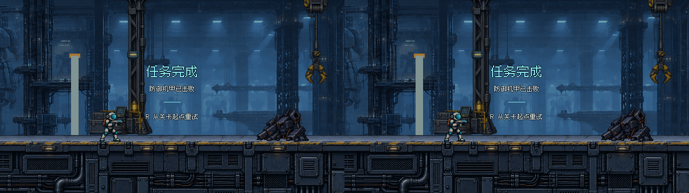

# THROWAWAY · #27 A/B/C HUD 对照

**临时原型，不是最终设计。A 仍是当前偏好；C 是用户追加的常规布局探索。** 本轮问题：真实 640×360 战斗中，A 左上轻量生命还是 C 左下头像生命框更清楚，C 顶中 Boss 条是否更好找？C 的死亡/完成与 A 完全相同，专门隔离 HUD 变量。

沿用 `throwaway-ab/` 路径是为了保持既有入口有效；查看器与文档已扩展为 A/B/C。原 A/B 三态样本未变，仍可对照。没有精修正式资产、接入游戏或修改 #32 闸门。

## 一键打开

双击 [Open-Prototype.cmd](Open-Prototype.cmd) 或浏览器打开 [viewer.html](viewer.html)。无需安装依赖、无需服务器。

- 地址支持 `?variant=A` / `B` / `C`，默认 A；左右箭头或底部按钮按 A→B→C→A 循环，左箭头反向。
- `1–6` 或状态按钮：普通交火、低血、机甲战、左侧缺口、失败、完成。
- “并排 A/C”是本轮重点；也保留“并排 A/B”。原生/2× 按钮在 640×360 与1280×720之间切换，像素最近邻显示。
- 始终标明 THROWAWAY、当前变体、状态、生命和机甲读数。结算提示 C 与 A 相同；查看器只切静态图，R 不会执行重试。

GitHub 只能看图，不能直接运行 HTML，需下载完整目录或在本工作树打开。既有浏览器工具禁止 file://，本轮没有绕过；因此查看器的浏览器按钮/键盘仍未实测，不能据此宣称浏览器验收通过。

## 同帧 A/C：左 A / 右 C

组合图1280×360，每半边原生640×360；各方案同态背景完全一致。可用查看器原生或2×比较。

### 普通交火（3/3，无 Boss）


### 低生命（1/3，28/42）


### 机甲战（3/3，28/42）


### 左侧缺口：暴露 C 的遮挡代价


### 死亡 / 完成（C 与 A 相同）



## 布局与观察

| 方案 | HUD | 结算 |
| --- | --- | --- |
| A（当前偏好） | 左上“生命”+三格；右上 Boss 信息；无整体底板 | 居中文字 |
| B（保留对照） | 顶部薄底条 | 单层面板 / 左对齐 |
| C（新增探索） | 左下紧凑金属框含头像和三格，Boss 顶部正中 | **直接沿 A** |

C 的唯一生命容器是 `[12,304,152,44]`，距左/底12px，头盔头像位于 `[18,309,36,36]`。三格18×10，x=62/86/110、y=328；1/3仅第一格琥珀实填，另两格空轮廓，同时显示“危险”。Boss 轨道 `[224,31,192,6]` 以屏幕 x=320 为中心，只有原场景 Boss 已激活才显示；没有沿用 A 的右上位置。字体/颜色/实际读数与A相同。

头像最初按头肩整图缩小，读起来像小图标；这轮按反馈在**同一36×36区域**改为头盔近景，源采样 `[310,184,656,632]`。没有增大框或遮挡面积。仍是粗排头像，未作为最终美术批准。

**遮挡检查与取舍：**

- 普通交火/低生命/机甲战：C 框覆盖甲板立面，不覆盖截图中的行动员、敌人、弹道、入口挡板或地面行走顶边。
- 所有四个游玩样本，y=40..303 区域与原始捕获逐像素一致；地面顶部和站立角色保持可见。但这不等于整个游戏无挡视线风险。
- **左侧缺口样本：C 遮住缺口下部以及一段黄色竖向警戒边。** 顶部开口仍完整，但洞深语境减少；A 无此遮挡。没有为掩盖问题移位或抹掉场景。需要用户决定是否接受；若选 C，后续再讨论缩窄、透明、动态避让等方案，本轮不擅自增加逻辑。
- 上述是固定镜头观察，不替代动态跑跳、跌落和真人反应验收。C 分散至上下两端，读取距离是否值得头像识别收益，也应由人审判断。

## 真实取样和来源

固定沿用 #28 后 `main` 提交 **`3f970aafdd4628d0da931997197e630a7736735b`**，机甲上限42，不是旧120基线。本轮不拉入 #32 闸门改动。

三态原 A/B 捕获与PNG字节不变；新增状态由同一固定源码副本捕获一次后供A/B/C共用：普通交火x=900、低血与机甲x=3510、缺口靠左x=1460，均使用原场景受击/死亡/机甲规则。实际记录在 [states.json](captures/states.json)。普通/缺口未激活Boss，显示隐藏；低血为1/3、28/42，结算机甲0/42。

- `capture_main.gd` 只在本目录被忽略的 `.capture-project/` 固定提交副本执行。`rebuild.py` 用 git archive 展开，不改正式关卡文件、不写主仓库、不创建第二个Git工作树。
- `render_ab.gd` 是A/B/C的可编辑原生Godot绘制源；生成18张原生PNG和A/B、A/C并排图。
- [头像原始PNG与完整提示词](source/PORTRAIT.md)：内置ImageGen，以本项目 #22 已确认 `assets/pixel/operative.png` 为唯一角色参考，透明原创头肩图；未使用他人角色或未知授权素材。只改本票原型，未替换游戏角色。最终头盔裁切在Godot采样时进行，原PNG未改。
- Fusion Pixel 字体与旧金属面板的来源/许可仍见父目录 [source](../source/)，新框为原生简单像素线条，不新增第三方素材。

## 复现与简要验证

已有图和查看器可离线查看。改排版后：

```powershell
& Godot_v4.7.2-stable_win64_console.exe --path . --rendering-method gl_compatibility --script prototypes/issue-27-ui/throwaway-ab/render_ab.gd
```

补捕获缺失状态并渲染：`python prototypes/issue-27-ui/throwaway-ab/rebuild.py`。需要Git、Python、PATH中的Godot4.7.2图形会话。已有捕获会保留，不让不同捕获时序污染对照；如主动重采某状态，先移走其PNG后运行。

最终Godot渲染无错误/警告。18张原图尺寸640×360；既有A/B战斗/失败/完成与480d869字节一致；C和A结算像素一致；四张游玩中间带与真实捕获像素一致。查看器源码已核对三向循环、C URL和状态实际数据；浏览器实测限制如上。依prototype流程不增加测试套件或发布打包。

## 待用户比较

1. 头像与左下三格能否更快建立“这是我的生命”的识别？还是A始终更容易一眼扫到？
2. C 顶中 Boss 比 A 右上好找吗？上下分置是否增加视线往返？
3. 是否接受左侧缺口下部被遮挡的代价，或继续以A为优先方向？

A偏好记录保留，C尚未获选。保持 #27 开放、ready-for-human；不合并、不接入、不修改 #32。
