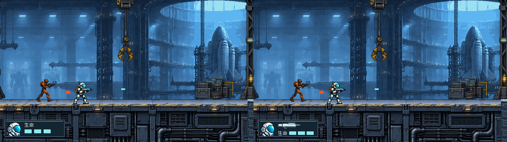
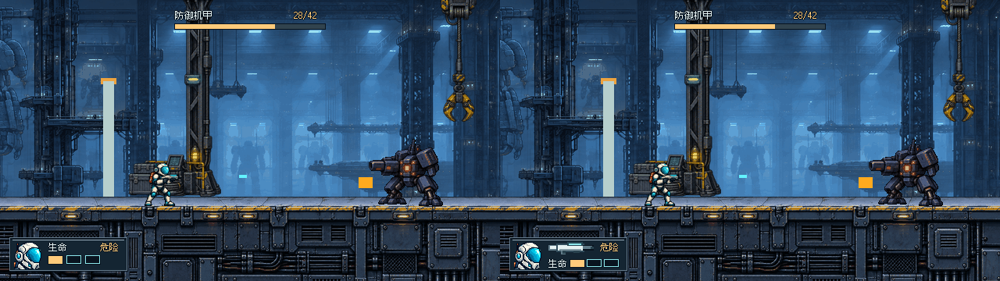
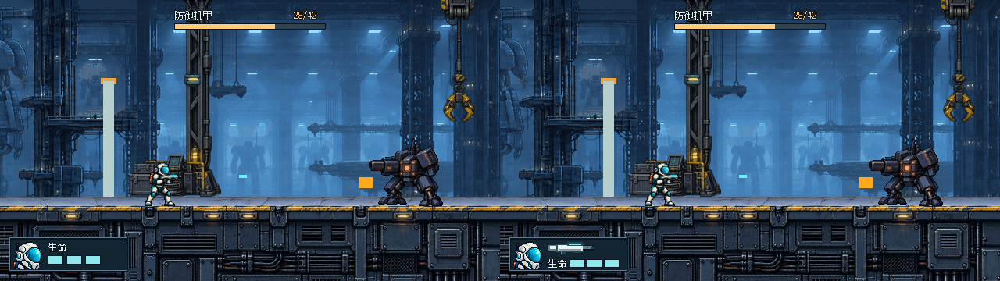
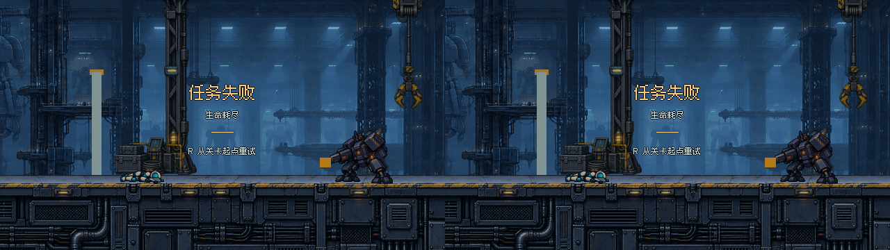

# THROWAWAY · #27 A/B/C/D 原型

**当前比较 C/D：用户认可 C 作为下一轮基底，D 在同尺寸模块里加入现用枪械并重排三格生命。仍未最终批准。** A/B/C 全部保留；本轮不改正式游戏、不改 #32 门体、不加弹药/换枪或自动避让。

## 一键查看

双击 [Open-Prototype.cmd](Open-Prototype.cmd) 或本地浏览器打开 [viewer.html](viewer.html)。无需服务器、依赖安装。

- 默认 D，地址支持 `?variant=A/B/C/D`；左右键/底部按钮正反循环 A→B→C→D→A。
- `1–6` 或按钮：普通交火、1/3、机甲战、左侧缺口、失败、完成。
- “并排 C/D”是本轮重点；A/C、A/B 对照也保留。
- 原生640×360 / 整数2×1280×720切换；页面始终标明THROWAWAY、当前方案、状态和真实读数。
- 查看器只显示静态原生渲染图，R文案不触发游戏重试。GitHub不运行HTML，需本地打开。

内置浏览器禁止file://，本轮没有绕过该限制，浏览器按钮/键盘交互仍未实测。源码路径/参数/循环已核对，不能称为浏览器验收通过。

## 同帧 C/D：左 C / 右 D

每半边为640×360原生，组合图1280×360。原图位于images/，查看器可切2×。

### 普通交火


### 1/3 低生命


### 机甲战


### 左侧缺口：保留遮挡，不隐藏代价


### 失败 / 完成：C与D相同，沿A结算



## D 改了什么

C 与 D 共用 `[12,304,152,44]` 金属外框、`[18,309,36,36]` 头盔头像和顶部居中Boss条。**D没有增加覆盖面积。** 差异集中在框右侧：

| 区域 | C | D |
| --- | --- | --- |
| 右上 | 生命标签 / 危险词 | 58×16现用枪械轮廓，低血时旁边“危险” |
| 右下 | 三格生命 | “生命”与三格横排，格为18×9，位置x=90/112/134、y=333 |
| 头像 | 36×36头盔近景 | 原样保留，不缩小给枪让位 |
| Boss / 结算 | 顶中Boss，文字结算 | 完全沿用C |

枪械以项目 #22 已确认 `assets/art_source/operative-sheet.png` 中行动员的**白色横向机身、青色顶部导轨、深色短枪口/握把**为依据，由Astra用原生Godot像素矩形绘制。图形源是 `render_ab.gd` 的 `current_rifle()`，不裁入手臂，不下载外部图标，不使用新生成位图。它只表示当前枪，不是可点选按钮，没有弹药数、库存或切枪提示。三格血量只有一组，没有重复3/3。

这是信息层级粗排：原C的“生命标签→三格”改成“现用枪→生命标签/三格”上下两排。58px枪械保持水平识别轮廓，但细节明显简化；原生大小是否一眼能读成角色当前武器，仍待人审，不宣称已达到正式图标质量。

## 遮挡与视线的诚实结果

- 普通/低血/机甲样本中，两方案均不遮住画面里的角色、敌人、弹道、门体、可行走地面顶边；覆盖的是左下甲板立面。
- **左侧缺口样本中，两者仍遮住缺口下部与部分黄色竖向警戒边。** 上方开口可见，但洞深语境减少。D没扩大这一区域，也没有解决C已有问题。
- 四个游玩样本C/D像素差异仅在 `[61,310,92,34]` 的既有框内；框外背景、顶部Boss、头像与边框均相同。
- 失败/完成C=D=A逐像素一致，专门隔离战斗HUD变量。没有因为加枪而把结算也一起改掉。
- 以上是固定镜头观察，不代表运动中跑跳/跌落可读性通过。左下信息与顶中Boss的视线往返、枪形是否抢生命，应交用户判断。

## 同一真实场景、来源与重建

固定游戏背景提交 **`3f970aafdd4628d0da931997197e630a7736735b`**，#28后机甲42HP，未混入旧120基线或 #32 门体美术。沿用C阶段全部捕获，不重新拍不同帧：普通交火x=900，机甲/低血x=3510，左侧缺口x=1460。实际记录见 [states.json](captures/states.json)：低血1/3、机甲28/42、完成0/42；普通与缺口不显示未激活Boss条。

- A/B/C既有18张原图相对4bc807e字节不变。
- 头像沿用 [原PNG / 提示词 / 来源](source/PORTRAIT.md)，仅C阶段内置ImageGen生成，本轮不生成新位图。头像采样`[310,184,656,632]`到36×36。
- 字体/原金属面板的版权与来源见父目录 [source](../source/)。新枪形为原生可编辑程序图形，无额外素材许可。
- 正式项目文件未修改。全部位于被`.gdignore`隔离的本票目录，`throwaway-ab`旧路径保持入口兼容。

改排版后在worktree根目录执行：

```powershell
& Godot_v4.7.2-stable_win64_console.exe --path . --rendering-method gl_compatibility --script prototypes/issue-27-ui/throwaway-ab/render_ab.gd
```

补捕获缺失状态：`python prototypes/issue-27-ui/throwaway-ab/rebuild.py`。它从固定提交git archive到本目录被忽略的`.capture-project/`运行，保留已有捕获；不写主仓库、不改运行时文件。需要Git、Python及PATH中的Godot4.7.2图形会话。

## 轻量验证 / 待人审

最终Godot渲染退出0、无错误警告；D六张原图640×360，C/D并排1280×360。已逐张检查普通/低血/机甲/缺口；A/B/C18图未变，C/D结算像素一致，游玩差异完全限于既有框内部。按prototype流程不加测试套件、不做发布打包。查看器浏览器实测限制见前文。

请比较：
1. 原生640×360中，枪械能否一眼认出与行动员现用枪一致？
2. 加枪后头像与三格生命是否仍好读，还是C的简洁更合适？
3. 左侧缺口下部遮挡的原有代价是否仍可接受？

本轮只是可运行粗排；保持 #27 开放、ready-for-human，不合并、不接入，#32不动。
