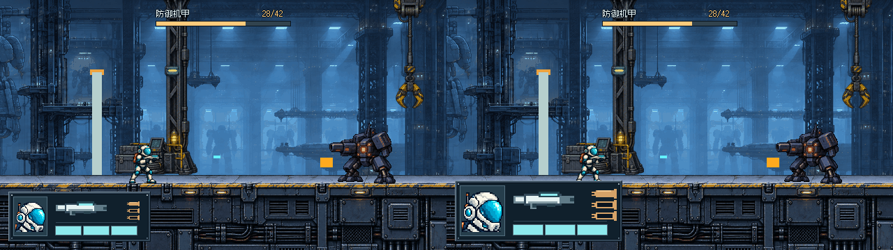
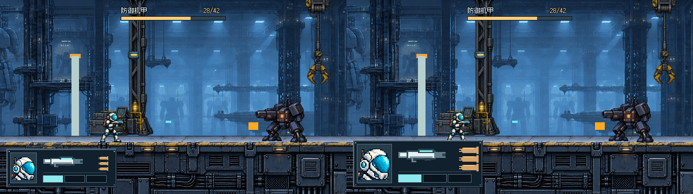
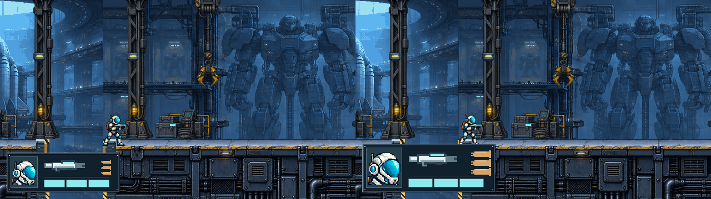
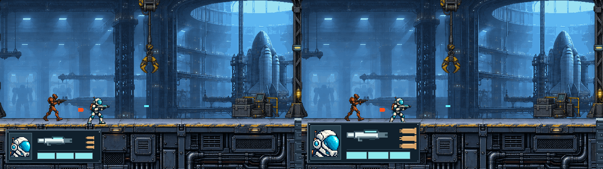

# THROWAWAY · 用户草图四区 HUD / 两档比例

**本轮单独比较紧凑/宽松，不追加到A–E五变体查看器。未最终确认、不接入正式游戏。** 原A–E文件和输出保留不动。

## 实际看过的参考

已在浏览器打开并滚动查看 [用户原始附件](https://github.com/user-attachments/assets/5fa7fc98-f609-4285-b1bc-9ea48e429c5d) 的完整左下草图，对应 [用户评论](https://github.com/immorcoding/hundouluo/issues/27#issuecomment-5884286058)。观察：头像是独立纵向栏；武器居中上；血量横排位于中下并延展到右；弹壳本体横向、三枚上下成列。不是旧E四元素塞进44px高横条，也不是要求照搬白底/草图像素比例。草图中的四个名词只作标注，图中不显示。

## 打开 / 切换

双击 [Open-Prototype.cmd](Open-Prototype.cmd) 或本地浏览器打开 [viewer.html](viewer.html)。左右键切紧凑/宽松，1–4切普通/机甲/低血/缺口；按钮切半/全自动**概念**、同帧两比例并排、原生/整数2×。

URL：`?variant=compact&mode=auto` 或 `?variant=roomy&mode=semi`。页面持续标明THROWAWAY、当前比例/状态/概念模式；本轮仅两种比例。GitHub不运行HTML，需要本地目录。

正式游戏仍只有按住shoot每0.16秒连发，没有模式切换；查看器不执行射击、切枪或弹药消耗。1实2空=半自动概念、3实=全自动概念，不是弹药库存。

## 左紧凑 / 右宽松：每半边640×360原生

### 机甲战 / 全自动概念


### 同血量半自动概念


### 1/3生命 / 全自动概念


### 左侧缺口：遮挡代价


### 普通交火


## 尺寸与取舍

| | 紧凑 | 宽松 |
| --- | --- | --- |
| 整体框 | `[12,276,204,72]`，全屏6.38% | `[12,260,240,88]`，全屏9.17% |
| 独立头像栏 | 48×56，图像44×44 | 64×72，图像60×60 |
| 武器 | 约73×20，中上 | 87×24，中上 |
| 横排生命 | 三格36×12、间隙4，y=326 | 三格42×14、间隙4，y=324 |
| 右列弹壳 | 每枚18×7，横向外形/上下单列 | 每枚36×14，外形整数2×，上下单列 |
| 外框/分区 | 薄金属边＋不透明暗底，纵栏独立 | 同语法，更大的纵栏与右侧模式列 |

青色横向实格只表示生命，暗空槽表示损失；铜色横向弹壳组成竖列表示模式。没有重复生命数字，没有危险词，没有草图标签。Boss血条仍居中上方，相同42HP基线（交战样本28/42）。

**诚实风险：**

- 紧凑框顶部y=276，样本中不遮正常站立角色脚底、地面顶边、弹道或门体，但遮住更大一片甲板立面和缺口深处。
- 宽松框顶部y=260、右缘252。机甲/普通样本中，它会盖到行动员脚部的少量像素及一段地面边缘；缺口样本中也压住靠右岸的脚部/岸边，并遮掉较多警戒竖边与洞深。不能把“看得更大”说成没有代价。
- 两案都比E的152×44大。宽松对头像、弹壳辨认更有利，紧凑对场景保留更多；需要人审决定比例，不自动避让、不靠切换背景隐藏。
- 本次先固定不透明暗底隔离比例变量。未另加第三案或运行时透明/避让功能；若选择方向后需要薄底/透明实验再单独处理。

## 制作与基线

背景直接复用 `../throwaway-ab/captures/` 已保存的 #28 后 `3f970aafdd4628d0da931997197e630a7736735b` 实际Godot捕获，相同状态不重新拍。`normal/combat/low/gap-left` 四帧与旧交付完全一致；没有合并main或 #32 门体。

`render.gd` 是本轮原生排版源；只继承旧原型的字体、背景读取和Boss/文字辅助，独立绘制新分区。头像沿既有内置ImageGen原图（[来源](../throwaway-ab/source/PORTRAIT.md)），枪械沿 #22 行动员武器像素轮廓重新按整数坐标排布，弹壳与金属边为原生图形；没有新增生成位图、外部资产或字体。字体许可证仍在父级source/fonts。原草图只链接作为用户指令参考，未作为游戏纹理。

重建（在指定worktree根目录）：

```powershell
& Godot_v4.7.2-stable_win64_console.exe --path . --rendering-method gl_compatibility --script prototypes/issue-27-ui/throwaway-block-layout/render.gd
```

输出2比例×2模式×4状态=16张640×360原图、8张1280×360并排；查看器支持整数2×。不制作六态精修/生产资源，不改正式HUD、level、#32。

## 本轮验证与待选问题

Godot实际渲染退出0、无错误警告；已目视普通/机甲/低血/缺口两比例图，明确看到宽松方案脚部/地面遮挡。按prototype流程不加测试套件/发布打包。旧A–E目录无改动；新查看器源码与图片路径已核对，但内置浏览器此前禁止本地file://，本轮不绕过该限制，浏览器交互未实测。静态比较不是动态真人验收。

需要选择：哪档分区更接近草图意图？紧凑头像/弹壳是否够认？宽松增加的可读性是否值得脚部/地面遮挡？模式与生命是否仍容易混淆？

保持 #27 开放、ready-for-human；未批准、不合并、不接入。
