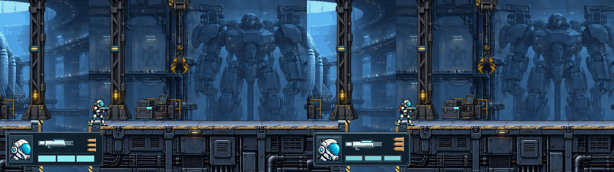
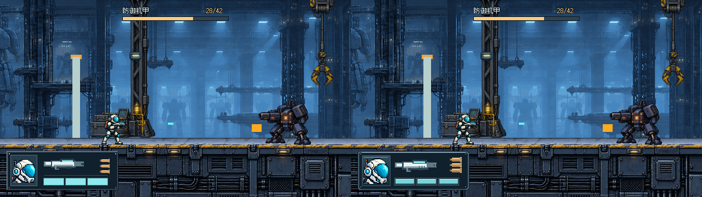
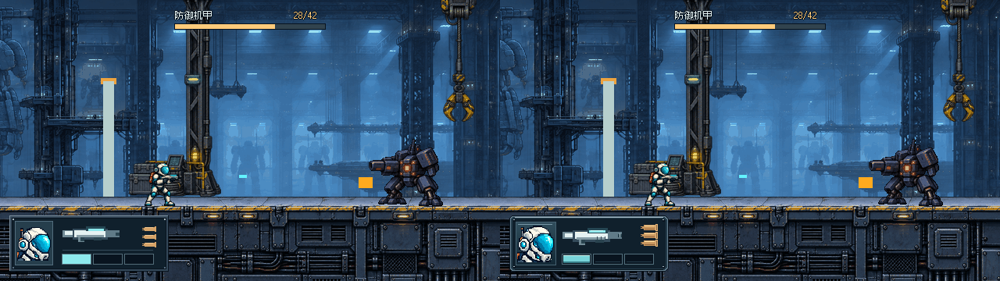
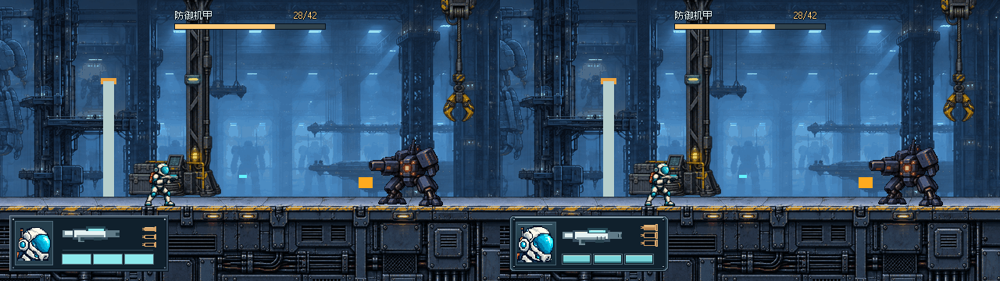

# THROWAWAY · 已认可紧凑结构的小幅精修

**待用户再次确认，未接入游戏。** 沿用204×72四区结构：左纵向头像、中上武器、中下三格生命、右侧三枚横放弹壳。不是重新选布局，不修改旧A–E/两比例原交付。

## 短线误会已更正

实际打开了 [用户截图](https://github.com/immorcoding/hundouluo/issues/27#issuecomment-5884529924)。最初把目标误认成场景青色弹丸；收到 [明确纠正](https://github.com/immorcoding/hundouluo/issues/27#issuecomment-5884585107) 后，改为删除**HUD内、枪械与生命格之间**的分隔线。

来源是上一轮 `throwaway-block-layout/render.gd` 的 `draw_rect(Rect2(mid_x, life_y - 6, ...))`，紧凑案位于x80、y320，宽116、高1。精修绘制不再画这条线。**场景青色弹丸未擦除、未隐藏；正式弹丸资源、玩法与背景捕获均未修改。** 为便于追溯，旧原型不变，前后对照右边才是已移除分隔线的版本。

误判阶段产生的本地诊断文件已弃用并被.gitignore隔离，不随提交分发、不由任何交付入口调用。本交付直接读取旧 `throwaway-ab/captures/` 原图，根本不使用清理版背景。

## 查看前后

双击 [Open-Prototype.cmd](Open-Prototype.cmd) / 本地浏览器打开 [viewer.html](viewer.html)。默认精修后缺口镜头；左右键切前后、1–4切普通/机甲/低血/缺口，按钮切半/全自动概念、前后并排和原生/整数2×。URL `?variant=before` / `after`；页面始终标明THROWAWAY及当前状态。

模式仍仅美术概念（1实2空/3实），不是新增射击机制。旧有0.16秒按住连发行为不变。

以下每张**左精修前 / 右精修后**，各半边640×360，同一原始场景：

### 用户关注的缺口镜头


### 机甲战


### 低血1/3


### 半自动概念


[普通交火](images/compare-auto-normal.png)。独立原生图在images/，查看器可2×。

## 小幅变化

| 部位 | 精修前 | 精修后 |
| --- | --- | --- |
| 整体 | 204×72，x12/y276 | 尺寸、位置完全不变 |
| 框 | 平直压边 | 4px切角、较暗下沿、少量固定点高光；不加外圈占地 |
| 头像栏 | 48×56、头像44×44 | 栏宽52，头像48×48，仍是独立纵栏；背板上亮下暗，未重画角色 |
| 武器 | 约73×20 | 约77×21，略下移；补导轨高光、枪口/握把和少量通风槽对比 |
| 生命 | 36×12青色实块 | 同尺寸/位置，细内缘、上沿亮线与下沿阴影；空槽更暗；不加重复数值 |
| 弹壳 | 18×7 | 22×9，细化筒身亮暗和底缘；仍右侧单列、三枚横放 |
| 多余分隔线 | 枪械和生命间1px横线 | 已移除 |

头像PNG本身未编辑，仍引用既有原创来源；光影主要来自栏内背板与金属压边。枪械与弹壳为原生像素图形，没有新生成位图、字体或外部素材。

## 遮挡与验证

四状态×两概念模式共8组前后：左图与上一轮compact图逐像素一致，前后所有差异仅在 `[12,276,204,72]` 内。场景弹丸、人物、门体、Boss条及框外场景均保持原像素。所有原图640×360，对照图1280×360，Godot最终渲染成功且无错误/警告。

缺口下部与部分黄色竖边仍受框遮挡，**没有增加，也没有解决**；紧凑框仍在正常站立角色/地面顶部下方。没有自动避让或抹图；静态帧不等于运动中可读性通过。

依prototype流程不新建测试套件或打包。查看器源码/链接已核对；内置浏览器此前拒绝file://，本轮不绕过，浏览器交互未实测。

## 制作与复现

原始场景来自 #28后固定提交 `3f970aa`，42HP，机甲示例28/42。只复用既有截图与源资产，不改正式项目、#26弹丸或 #32门体。

在原worktree根目录：

```powershell
& Godot_v4.7.2-stable_win64_console.exe --path . --rendering-method gl_compatibility --script prototypes/issue-27-ui/throwaway-compact-refine/render.gd
```

源代码在本目录；复用前轮 `BlockLayout` 作before，Refined只改本轮绘制。头像来源/提示词见 [原型头像记录](../throwaway-ab/source/PORTRAIT.md)，字体许可见父级source/fonts。保留前轮源与图可离线复现。

待用户再确认：去线后间隔是否舒服；头像与枪比例是否合适；生命实空差别和弹壳轮廓是否更清楚。#27保持OPEN、ready-for-human，不合并、不接入。
