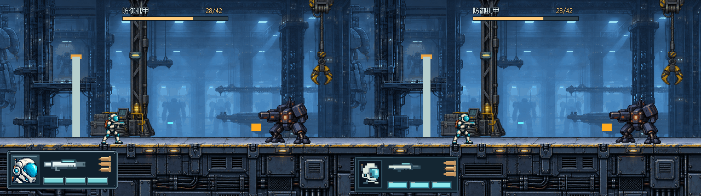
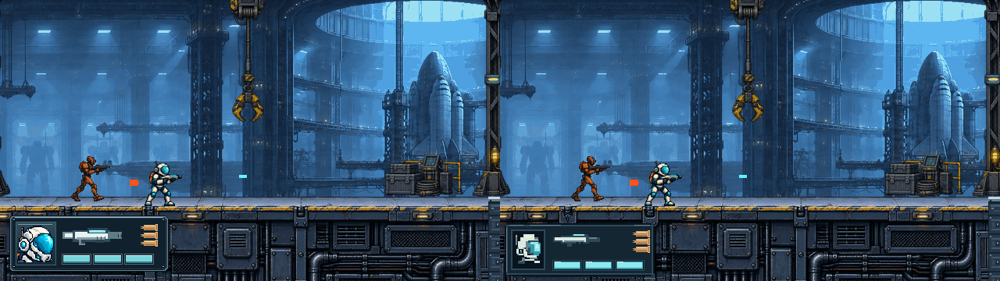
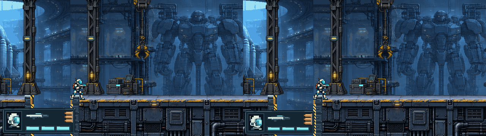
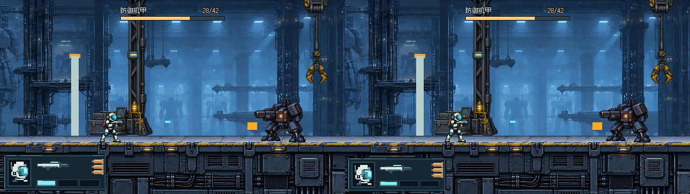

# THROWAWAY · 更小、更靠左下、原生像素簇 HUD

本轮保留已认可四区结构和已删除的枪/生命分隔线，比较旧稿与两个接近的尺寸/边距。**未最终批准、未接入正式游戏。** 原A–E、两比例、紧凑精修目录不改。

## 总体美术文档与执行依据

已完整读取 main `9d4c246` 的 [docs/art/STYLE_GUIDE.md](https://github.com/immorcoding/hundouluo/blob/9d4c246/docs/art/STYLE_GUIDE.md)。它是关卡、角色、敌人、门、弹丸、特效、HUD、结算的统一目标；旧 `docs/art/README.md` / art_source README 是制作记录，不表示所有现有资产都达标。

本轮针对指南的像素簇、硬边、局部有限色阶、整数位置及相邻资产颗粒要求落实在原型；**不宣称只改HUD就解决了全项目风格问题**。背景/角色/弹丸保持实际截图，便于和新UI相邻比较。死亡/通关界面也没有因本轮获选而自动验收。

## 三项对照（不是三个全新结构）

| 方案 | 框尺寸和坐标 | 左/下边距 | 较旧稿面积 |
| --- | --- | --- | --- |
| old 原稿 | 204×72，`[12,276]` | 12 / 12 | 基准 |
| S6 | 192×68，`[6,286]` | 6 / 6 | 减少11.1% |
| S4 | 184×64，`[4,292]` | 4 / 4 | 减少19.8% |

S6内部留白更充足，作为查看器默认起点；S4更靠角落、生命更紧。这只是当前试排判断，不代替用户选择。头像纵栏、武器中上、生命中下、弹壳右列、顶中Boss保持关系不变。

## 原生图：左旧稿 / 右 S6




## 左 S6 / 右 S4



[半自动对照](images/compare-six-four-semi-combat.png)。每半边640×360，整图1280×360。

## 可见的像素制作变化

本轮**没有对旧整块HUD或高清头像直接缩图**。`render.gd` 中重新用整数矩形/阶梯轮廓排布：

- 头像按40×44原生逻辑网格重新解释已确认行动员的白色圆盔、青色面罩和侧耳结构；以2px明暗大块加少数1px边缘组织，有限色阶。它是UI头像候选，不替换角色精灵；比生成图更简化，辨认是否足够需人审。
- 枪形固定60×18原生像素，以2px机身/导轨/枪口块构成，不使用1.32倍等非整数缩放。沿 #22 原枪的白身/青色上导轨/深枪口识别语言。
- 头像栏取消逐行渐变；面板用三档暗蓝灰、两阶切角和分段高光，不画连续柔化边缘。高光簇与机库相邻甲板/角色的1–2px细部一起审看。
- 生命保持横排青色：S6每格36×12，S4每格34×10；实格用固定亮/中/暗三档，空格为暗槽。弹壳维持22×9铜色原生形态，三枚横放竖列，不缩小；半/全自动仍仅1实2空/3实概念。
- 没有危险词、没有恢复枪械与生命之间的短线、没有新增标签或玩法。

色阶与轮廓减法使像素簇更明显，但它也简化了头像/枪的小细节。请在原生尺寸对照场景而不是仅看放大图；这不是宣称“格子越大越像素”。字体仍沿用现原型，指南允许字体为可读性例外，本轮不同时引入字体变量。

## 缺口与可认性

原始 #28后 `3f970aa` 的42HP背景同帧、原弹丸全部保留。S6顶部降到286、S4降到292，分别比旧稿向下10/16px，右缘也收至198/188；因此角色/地面顶边更有余量。普通和机甲镜头没有遮住角色、弹道或门体。

**缺口下部及黄色竖边仍有遮挡，未解决。** 相比旧稿少覆盖上部和右岸区域，左移又多覆盖左侧立面；保持对照，不抹图、不自动避让。S4的4px边距和较窄生命格是否仍舒服，需要实际窗口人审。

## 一键查看 / 复现

双击 [Open-Prototype.cmd](Open-Prototype.cmd) 或本地打开 [viewer.html](viewer.html)。左右循环old/S6/S4；1–4切普通/机甲/低血/缺口；可切模式概念、旧/S6或S6/S4并排，以及整数2×。URL支持 `?variant=six` / `four` / `old`。页面标明THROWAWAY与当前方案。

```powershell
& Godot_v4.7.2-stable_win64_console.exe --path . --rendering-method gl_compatibility --script prototypes/issue-27-ui/throwaway-pixel-fit/render.gd
```

仅新增本目录。数据/字体/背景读取旧原型，素材源与许可仍保留；新图标是Astra原生程序绘制，没有新增位图生成/外部素材。实际射击仍按住0.16秒连发，无模式切换。未改正式HUD/关卡/#26/#32。

## 轻量验证 / 待审

Godot渲染成功无错误/警告；24张原生640×360、16张并排1280×360。old图与1137dda精修稿像素一致；新旧y<276区域全部像素不变，场景弹丸与Boss等未改。已目视原生图比较角色、图标、缺口。按prototype流程不添加测试套件或发布打包；内置浏览器的file://限制仍在，查看器浏览器交互未实测。

请选S6或S4的尺寸/边距，并判断原生头像、枪、弹壳是否好认，硬边/颗粒是否与甲板和角色协调。保持 #27 OPEN、ready-for-human，等待再次确认；未合并、未接入，死亡/通关和全局美术仍需各自验收。
