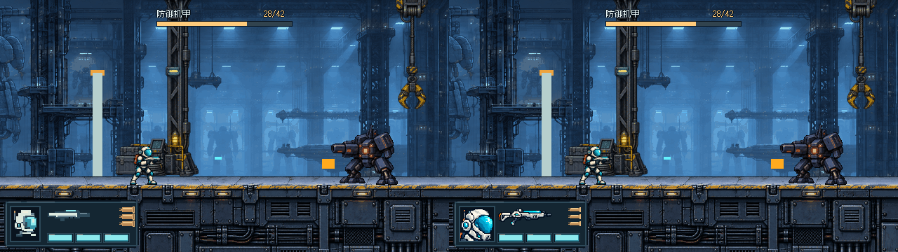
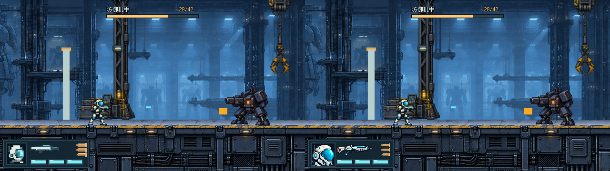
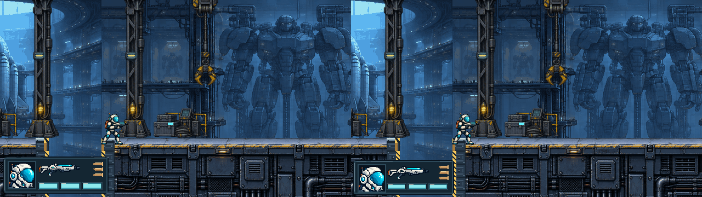
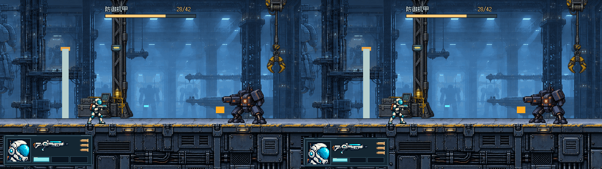

# THROWAWAY · 忠实修正：旧头像＋新版比例

按 [用户原话](https://github.com/immorcoding/hundouluo/issues/27#issuecomment-5885235170) 和 [澄清](https://github.com/immorcoding/hundouluo/issues/27#issuecomment-5885486769) 执行四点：**保留1137dda旧详细头像；保留S6/S4尺寸位置；弹壳变小；枪械适配旧头像材质。** 不再重画头像、不发散布局。仍是THROWAWAY，未最终批准。

## 四点对应

| 用户要求 | 本轮实际处理 |
| --- | --- |
| 旧头像保留 | 直接读取 `throwaway-ab/source/operative-portrait.png`，沿用1137dda的源裁切 `[310,184,656,632]`、48×48显示。无调色、无重画、无新块状头盔替换；只有位置改变 |
| 新比例保留 | S6仍192×68，`[6,286]`，左下6px；S4仍184×64，`[4,292]`，左下4px |
| 弹壳调小 | 22×9减至18×7，保持三枚横向本体上下成列、铜色实填/空轮廓 |
| 枪械与头像统一 | 以**旧详细头像为风格参考、#22角色武器为身份参考**，内置ImageGen制作独立青白金属枪形；76×24原生显示，明暗/轮廓沿旧头像而非反过来改头像 |

旧头像源SHA256仍为 `b75806042e0db94436d921c4a69ccf4fb8a366fa75d66249743a1ce4cefc95af`。S6头像显示 `[16,296,48,48]`，S4为 `[14,302,48,48]`；两档这48×48区域逐像素相同。头像栏扩到52px，S6中部起点向右2px到x70、S4到x66，四区不变；S4头像栏与枪区只有2px间隔，更紧但没有挤压/覆盖。

## 同场景前后

**“修正前”指上一轮误换为块状头像的S6/S4，不是用户要求保留的1137dda旧详细头像。右边才是恢复旧详细头像的本轮。**

### S6：左修正前 / 右本轮


### S4：左修正前 / 右本轮


### 本轮：左S6 / 右S4，缺口


### 本轮：左S6 / 右S4，1/3生命


[普通交火](images/compare-six-four-auto-normal.png) · [半自动概念](images/compare-six-four-semi-combat.png)。每半张640×360原生，组合1280×360。

## 查看器

双击 [Open-Prototype.cmd](Open-Prototype.cmd) 或本地打开 [viewer.html](viewer.html)。左右切S6/S4、1–4切普通/机甲/低血/缺口；可当前尺寸修正前后、新S6/S4并排、半/全自动概念与整数2×。URL `?variant=six` / `four`。页面持续标注THROWAWAY和当前档位。

半/全自动依旧仅视觉概念，正式游戏仍按住shoot、0.16秒间隔连发；不加模式机制、弹药或新入口。结算不在这轮改动/确认范围。

## 来源、基线与边界

所有图共用原 #28后 `3f970aa` 实际场景、42HP（机甲样本28/42），不重拍/擦除弹丸；HUD内已删短分隔线没有恢复。原头像、原场景、正式HUD、关卡、#26与 #32 均未修改。

新枪械原始RGBA PNG、工具标识和完整提示词在 [source/PROMPT.md](source/PROMPT.md)。生成输入只有本项目旧头像和 #22 原角色图；没有第三方角色或素材包。源PNG不覆盖旧图，采样 `[136,118,1928,540]` 到76×24，nearest；仍是生成辅助原型，不声称手绘或已获美术批准。源记录中保留许可/权利边界，既有字体许可仍沿原目录。

本轮枪形比之前的程序横条有更丰富的机身/握把/导轨层次；显示尺寸有限，小细节会损失，材质是否与旧头像协调仍交用户审看，不以自动检查代替。

## 可读性与遮挡

两档都放得下原48px头像，未缩小/改画以迁就S4。S6留白更充足；S4头像栏与枪区较近，但图形及生命格没有相互覆盖。缩小弹壳给右列增加空白，仍保持实/空区别。

**框尺寸与位置都没变，缺口下部遮挡仍然存在，没有扩大，也未解决。** 普通/机甲样本角色、正常弹道、地面顶边和门体不受本轮新增覆盖。前后差异仅在旧框内部（S6 x16..191/y294..346；S4 x12..181/y300..351）；框外和Boss条原像素一致。

## 复现与轻量验证

```powershell
& Godot_v4.7.2-stable_win64_console.exe --path . --rendering-method gl_compatibility --script prototypes/issue-27-ui/throwaway-portrait-match/render.gd
```

Godot最终渲染成功无错误/警告；16张新640×360原生图、24张前后/两档1280×360对照。已检查S6/S4头像48×48逐像素相同、旧源哈希未改、框外场景不变；旧交付目录无改动。按prototype流程不新增测试套件/发布打包。浏览器file://限制仍在，查看器浏览器交互未实测。

待再次确认的只有这四点及其小尺寸可读性；保持 #27 OPEN、ready-for-human，不合并、不接入，不宣称全局风格或整票已通过。
